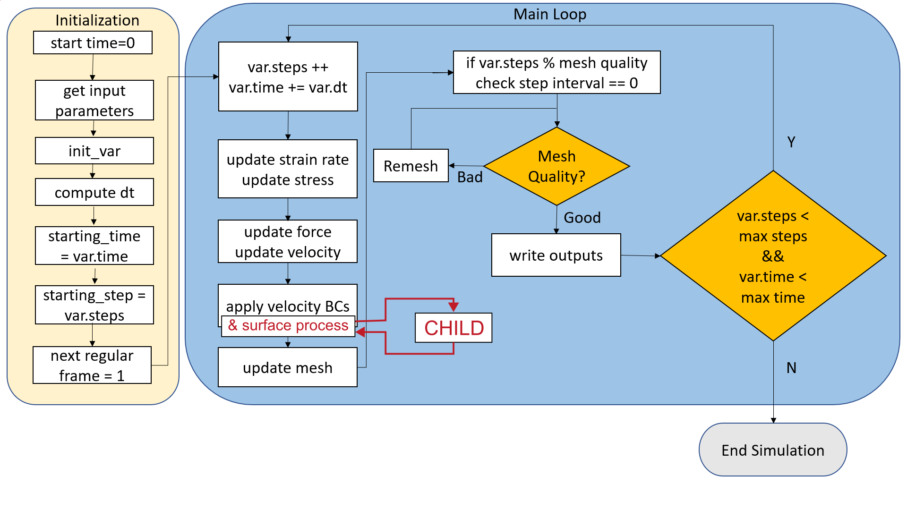

# Coupling DES3D with CHILD (in progress)

## Coupling strategy

- Build `CHILD` as a shared object
- Write `childInterface` class with appropriate methods that an external app (i.e., DES3D) can call to get and set the topography data that `CHILD` initializes and manages.
- In `DES3D`,
  - initialize `CHILD` through `childInterface`
  - prepare an array of pointers to the top boundary node coordinates (i.e., topography).
  - let CHILD run for `dt` and modify the topography.



## Prepare `child` and `childInterface`

### Get the codes

```SHELL
git clone https://github.com/GeoFLAC/Coupling_SNAC_CHILD
cd DynEarthSol
cp -r ../Coupling SNAC_CHILD/child .
cp -r ../Coupling SNAC_CHILD/childInterface .
```

### Build

```SHELL
cd child/bin
make
```

Note that `child/bin/Makefile` includes `gcc_shared.mk`. For other builds like the standalone `child`, choose a different `.mk` file.

```SHELL
cd childInterface
make
```

## Prepare `DES3D`

### Add relevant parameters to `parameters.hpp`

#### Add `child_input_file_name` to `struct Sim`


```C++
struct Sim {
...
    std::string modelname;
    std::string restarting_from_modelname;
    std::string child_input_file_name;
};
```

#### Add handles for the childInterface object and the arrays for the top boundary nodes and markers to `struct Variables`

In `struct Variables {}`

```C++
    childInterface *cI;
    // mutable because this coordinate array needs to be modified by CHILD even when Variables is const.
    mutable std::vector<double *> surf_points;
    std::vector<int> surf_bmarkers;
```

### Create and delete `childInterface` object as needed

#### Create during the initialization

In `dynearthsol.cxx:void init(const Param& param, Variables& var)`

```C++
#ifdef HAVE_CHILD
    const int_vec &top_nodes = *(var.surfinfo.top_nodes);
    const int ntop = var.surfinfo.ntop;    
    var.surf_points.clear();
    var.surf_bmarkers.clear();
    // loops over all top nodes
    for (std::size_t i=0; i<ntop; ++i) {
        int n = top_nodes[i];
        var.surf_points.push_back( (*(var.coord))[n] );
        if( (*var.bcflag)[n] & (BOUNDX0 | BOUNDX1 | BOUNDY0 | BOUNDY1) ) 
            var.surf_bmarkers.push_back(1);
        else
            var.surf_bmarkers.push_back(0);
    }
    if( var.cI != nullptr ) {
        delete var.cI;
        var.cI = nullptr;
    }
    var.cI = new childInterface;
    string argstr;
    argstr.append( param.sim.child_input_file_name );
    argstr.append( " --silent-mode" );
    (var.cI)->Initialize(argstr, ntop, var.surf_points, var.surf_bmarkers);
#endif
```

#### Create when restarting

In `dynearthsol.cxx:void restart(const Param& param, Variables& var)`

```C++
#ifdef HAVE_CHILD
    const int_vec &top_nodes = *(var.surfinfo.top_nodes);
    const int ntop = var.surfinfo.ntop;
    var.surf_points.clear();
    var.surf_bmarkers.clear();
    // loops over all top nodes
    for (std::size_t i=0; i<ntop; ++i) {
        int n = top_nodes[i];
        var.surf_points.push_back( (*(var.coord))[n] );
        if( (*var.bcflag)[n] & (BOUNDX0 | BOUNDX1 | BOUNDY0 | BOUNDY1) ) 
            var.surf_bmarkers.push_back(1);
        else
            var.surf_bmarkers.push_back(0);
    }
    if( var.cI != nullptr ) {
        delete var.cI;
        var.cI = nullptr;
    }
    var.cI = new childInterface;
    (var.cI)->Initialize(param.sim.child_input_file_name, ntop, var.surf_points, var.surf_bmarkers);
#endif
```

#### Recreate during remeshing 

At the end of `remeshing.cxx:void remesh()`,

```C++
#ifdef HAVE_CHILD
    const int_vec &top_nodes = *(var.surfinfo.top_nodes);
    const int ntop = var.surfinfo.ntop;
    var.surf_points.clear();
    var.surf_bmarkers.clear();
    // loops over all top nodes
    for (std::size_t i=0; i<ntop; ++i) {
        int n = top_nodes[i];
        var.surf_points.push_back( (*(var.coord))[n] );
        if( (*var.bcflag)[n] & (BOUNDX0 | BOUNDX1 | BOUNDY0 | BOUNDY1) ) 
            var.surf_bmarkers.push_back(1);
        else
            var.surf_bmarkers.push_back(0);
    }
    if( var.cI != nullptr ) {
        delete var.cI;
        var.cI = nullptr;
    }
    var.cI = new childInterface;
    string argstr;
    argstr.append( param.sim.child_input_file_name );
    argstr.append( " --silent-mode" );
    (var.cI)->Initialize( argstr, ntop, var.surf_points, var.surf_bmarkers );
#endif
```

#### Delete at the end of simulation

At the end of `dynearthsol.cxx: int main()`

```C++
#ifdef HAVE_CHILD
    if( var.cI != nullptr )
        delete var.cI;
#endif
```

### Define a custom surface process routine as an option

In `bc.cxx`,

```C++
namespace {

    void simple_diffusion(const Variables& var)
    ...
#ifdef HAVE_CHILD
    void surface_processes_by_CHILD(Variables& var)
    {
        // Modify surface topo using CHILD
        var.cI->ModifyCoords( var.surf_points );
        // Run CHILD for dt.
        var.cI->Run( var.dt/3.1536e7 ); // dt should be given as [year].
        // Modify the surface topo using the
        var.cI->GetNewCoords( var.surf_points );
    }
#endif
}
```

And in `void surface_processes()`,

```C++
...
#ifdef HAVE_CHILD
    case 103:
        surface_processes_by_CHILD(var);
        break;   
#endif 
    default:
        std::cout << "Error: unknown surface process option: " << param.control.surface_process_option << '\n';
        std::exit(1);
    }
...
```

### Add CHILD input file name as a new input parameter

In `input.cxx:static void declare_parameters()`,

```C++
cfg.add_options()
        ("sim.modelname", po::value<std::string>(&p.sim.modelname),
         "Prefix for the output files")
        ("sim.child_input_file_name", po::value<std::string>(&p.sim.child_input_file_name)->default_value("hillslope1.in"),
        "child input file name")
```

## Build `DES3D`

Full listing of `Makefile`. Note the added option, `usechild`.

```Makefile
# -*- Makefile -*-
#
# Makefile for DynEarthSol3D
#
# Author: Eh Tan <tan2@earth.sinica.edu.tw>
#

## Execute "make" if making production run. Or "make opt=0 openmp=0" for debugging run.
##
## ndims = 3: 3D code; 2: 2D code
## opt = 1 ~ 3: optimized build; others: debugging build
## openacc = 1: enable OpenACC
## openmp = 1: enable OpenMP
## adaptive_time_step = 1: use adaptive time stepping technique
## use_R_S = 1: use Rate - State friction law
## useexo = 1: import a exodusII mesh (e.g., created with Trelis)
## usechild = 1: let CHILD handle surface process

ndims = 3
opt = 2
openacc = 0
openmp = 1
nprof = 0
gprof = 0
usemmg = 0
adaptive_time_step = 0
use_R_S = 0
useexo = 0
ANNFLAGS = linux-g++
usechild = 1

ifeq ($(ndims), 2)
	useexo = 0    # for now, can import only 3d exo mesh
endif

ifneq ($(adaptive_time_step), 1)
	use_R_S = 0   # Rate - State friction law only works with adaptive time stepping technique
endif

## Select C++ compiler and set paths to necessary libraries
ifeq ($(openacc), 1)
	CXX = nvc++
else
	ifeq ($(nprof), 1)
		CXX = nvc++
	else
		CXX = g++
	endif
endif
CXX_BACKEND = ${CXX}


## path to cuda's base directory
CUDA_DIR = # /cluster/nvidia/hpc_sdk/Linux_x86_64/21.2/cuda

## path to Boost's base directory, if not in standard system location
BOOST_ROOT_DIR =

########################################################################
## Select compiler and linker flags
## (Usually you won't need to modify anything below)
########################################################################

OSNAME := $(shell uname -s)

BOOST_LDFLAGS = -lboost_program_options
ifdef BOOST_ROOT_DIR
	# check existence of stage/ directory
	has_stage_dir = $(wildcard $(BOOST_ROOT_DIR)/stage)
	ifeq (, $(has_stage_dir))
		# no stage dir, BOOST_ROOT_DIR is the installation directory
		BOOST_CXXFLAGS = -I$(BOOST_ROOT_DIR)/include
		BOOST_LIB_DIR = $(BOOST_ROOT_DIR)/lib
	else
		# with stage dir, BOOST_ROOT_DIR is the build directory
		BOOST_CXXFLAGS = -I$(BOOST_ROOT_DIR)
		BOOST_LIB_DIR = $(BOOST_ROOT_DIR)/stage/lib
	endif
	BOOST_LDFLAGS += -L$(BOOST_LIB_DIR)
	ifneq ($(OSNAME), Darwin)  # Apple's ld doesn't support -rpath
		BOOST_LDFLAGS += -Wl,-rpath=$(BOOST_LIB_DIR)
	endif
endif

ifeq ($(useexo), 1)
	# path to exodus header files
	EXO_INCLUDE = ./seacas/include

	# path of exodus library files, if not in standard system location
	EXO_LIB_DIR = ./seacas/lib

	EXO_CXXFLAGS = -I$(EXO_INCLUDE) -DUSEEXODUS
	EXO_LDFLAGS = -L$(EXO_LIB_DIR) -lexodus
	ifneq ($(OSNAME), Darwin)  # Apple's ld doesn't support -rpath
		EXO_LDFLAGS += -Wl,-rpath=$(EXO_LIB_DIR)
	endif
endif

ifeq ($(usemmg), 1)
	# path to MMG3D header files
	MMG_INCLUDE = ./mmg/build/include

	# path of MMG3D library files, if not in standard system location
	MMG_LIB_DIR = ./mmg/build/lib

	MMG_CXXFLAGS = -I$(MMG_INCLUDE) -DUSEMMG
	ifeq ($(ndims), 3)	
		MMG_LDFLAGS = -L$(MMG_LIB_DIR) -lmmg3d
	else
		MMG_LDFLAGS = -L$(MMG_LIB_DIR) -lmmg2d
	endif
	ifneq ($(OSNAME), Darwin)  # Apple's ld doesn't support -rpath
		MMG_LDFLAGS += -Wl,-rpath=$(MMG_LIB_DIR)
	endif
endif

ifeq ($(usechild), 1)
	CHILDCODE_DIR = ${HOME}/opt/DynEarthSol/child/Code
	CHILDBIN_DIR = $(CHILDCODE_DIR)/../bin
	CHILDINTERFACE_DIR = ${HOME}/opt/DynEarthSol/childInterface
	CHILD_CXXFLAGS =-I$(CHILDINTERFACE_DIR) -I$(CHILDBIN_DIR) -I${CHILDCODE_DIR} -DHAVE_CHILD=1
	CHILD_LDFLAGS =-g -L$(CHILDINTERFACE_DIR) -lchildInterfaceWrapper
	CHILD_LDFLAGS +=-L$(CHILDBIN_DIR) -lchild
	CHILD_LDFLAGS += -Wl,-rpath=$(CHILDBIN_DIR) -Wl,-rpath=$(CHILDINTERFACE_DIR)
endif

ifneq (, $(findstring clang++, $(CXX)))
	CXXFLAGS = -v -DGPP1X
	LDFLAGS = -v

	ifeq ($(opt), 1)
		CXXFLAGS += -O1
	else ifeq ($(opt), 2)
		CXXFLAGS += -O2
	endif
 
	ifeq ($(openmp), 1)
		CXXFLAGS += -fopenmp
		LDFLAGS += -fopenmp
	endif

else ifneq (, $(findstring g++, $(CXX_BACKEND))) # if using any version of g++
	CXXFLAGS = -g -std=c++0x
	LDFLAGS = -lm
	TETGENFLAG = -Wno-unused-but-set-variable -Wno-int-to-pointer-cast

	ifeq ($(opt), 1)
		CXXFLAGS += -O1
	else ifeq ($(opt), 2)
		CXXFLAGS += -O2
	else ifeq ($(opt), 3) # experimental, use at your own risk :)
		CXXFLAGS += -march=native -O3 -ffast-math -funroll-loops
	else # debugging flags
		CXXFLAGS += -O0 -Wall -Wno-unused-variable -Wno-unused-function -Wno-unknown-pragmas -fbounds-check -ftrapv
	endif

	ifeq ($(openmp), 1)
		CXXFLAGS += -fopenmp
		LDFLAGS += -fopenmp
	endif

	ifeq ($(gprof), 1)
		CXXFLAGS += -pg
		LDFLAGS += -pg
	endif

	ifeq ($(OSNAME), Darwin)  # fix for dynamic library problem on Mac
		ANNFLAGS = macosx-g++-13
	endif

	GCCVERSION = $(shell $(CXX) --version | grep g++ | sed 's/^.* //g' | cut -d. -f1)

	ifeq ($(shell expr $(GCCVERSION) \> 10), 1)
		CXXFLAGS += -DGPP1X
	endif

else ifneq (, $(findstring icpc, $(CXX_BACKEND))) # if using intel compiler, tested with v14
	CXXFLAGS = -g -std=c++0x
	LDFLAGS = -lm

	ifeq ($(opt), 1)
		CXXFLAGS += -O1
	else ifeq ($(opt), 2)
		CXXFLAGS += -O2
	else ifeq ($(opt), 3) # experimental, use at your own risk :)
		CXXFLAGS += -fast -fast-transcendentals -fp-model fast=2
	else # debugging flags
		CXXFLAGS += -O0 -check=uninit -check-pointers=rw -check-pointers-dangling=all -fp-trap-all=all
	endif

	ifeq ($(openmp), 1)
		CXXFLAGS += -fopenmp
		LDFLAGS += -fopenmp
	endif

else ifneq (, $(findstring nvc++, $(CXX)))
	CXXFLAGS = -mno-fma
	LDFLAGS =
	TETGENFLAGS = 

	ifeq ($(opt), 1)
		CXXFLAGS += -O1
	else ifeq ($(opt), 2)
		CXXFLAGS += -O2
	endif

	ifeq ($(openacc), 1)
		CXXFLAGS += -acc=gpu -gpu=managed,nofma -Mcuda -DACC
		LDFLAGS += -acc=gpu -gpu=managed -Mcuda
		# CXXFLAGS += -acc=gpu -gpu=mem:managed,nofma -cuda -DACC
		# LDFLAGS += -acc=gpu -gpu=mem:managed -cuda
	endif

	ifeq ($(openmp), 1)
		CXXFLAGS += -fopenmp
		LDFLAGS += -fopenmp
	endif

	ifeq ($(nprof), 1)
		CXXFLAGS += -Minfo=mp,accel -I$(CUDA_DIR)/include -DUSE_NPROF
		LDFLAGS += -L$(CUDA_DIR)/lib64 -Wl,-rpath,$(CUDA_DIR)/lib64 -lnvToolsExt -g
	endif
else ifneq (, $(findstring pgc++, $(CXX)))
	CXXFLAGS = -march=core2
	LDFLAGS = 
	TETGENFLAGS = 

	ifeq ($(opt), 1)
		CXXFLAGS += -O1
	else ifeq ($(opt), 2)
		CXXFLAGS += -O2 -silent
	else ifeq ($(opt), 3)
		CXXFLAGS += -O3 -fast -silent
	endif
 
	ifeq ($(openmp), 1)
		CXXFLAGS += -mp
		LDFLAGS += -mp
	endif

	ifeq ($(nprof), 1)
			CXXFLAGS += -Minfo=mp -I$(CUDA_DIR)/include -DUSE_NPROF
			LDFLAGS += -L$(CUDA_DIR)/lib64 -Wl,-rpath,$(CUDA_DIR)/lib64 -lnvToolsExt
	endif
else
# the only way to display the error message in Makefile ...
all:
	@echo "Unknown compiler, check the definition of 'CXX' in the Makefile."
	@false
endif

## Is git in the path?
HAS_GIT := $(shell git --version 2>/dev/null)
ifneq ($(HAS_GIT),)
        ## Is this a git repository?
        IS_REPO := $(shell git rev-parse --s-inside-work-tree 2>/dev/null)
endif

SRCS =	\
	barycentric-fn.cxx \
	brc-interpolation.cxx \
	bc.cxx \
	binaryio.cxx \
	dynearthsol.cxx \
	fields.cxx \
	geometry.cxx \
	ic.cxx \
	ic-read-temp.cxx \
	input.cxx \
	matprops.cxx \
	mesh.cxx \
	nn-interpolation.cxx \
	output.cxx \
	phasechanges.cxx \
	remeshing.cxx \
	rheology.cxx \
	markerset.cxx

INCS =	\
	array2d.hpp \
	barycentric-fn.hpp \
	binaryio.hpp \
	constants.hpp \
	parameters.hpp \
	matprops.hpp \
	sortindex.hpp \
	utils.hpp \
	mesh.hpp \
	markerset.hpp \
	output.hpp

OBJS = $(SRCS:.cxx=.$(ndims)d.o)

EXE = dynearthsol$(ndims)d


## Libraries

TET_SRCS = tetgen/predicates.cxx tetgen/tetgen.cxx
TET_INCS = tetgen/tetgen.h
TET_OBJS = $(TET_SRCS:.cxx=.o)

TRI_SRCS = triangle/triangle.c
TRI_INCS = triangle/triangle.h
TRI_OBJS = $(TRI_SRCS:.c=.o)

M_SRCS = $(TRI_SRCS)
M_INCS = $(TRI_INCS)
M_OBJS = $(TRI_OBJS)

ifeq ($(ndims), 3)
	M_SRCS += $(TET_SRCS)
	M_INCS += $(TET_INCS)
	M_OBJS += $(TET_OBJS)
	CXXFLAGS += -DTHREED
endif

ifeq ($(adaptive_time_step), 1)
	CXXFLAGS += -DATS
ifeq ($(use_R_S), 1)
	CXXFLAGS += -DRS
endif
endif

ifeq ($(useexo), 1)
	CXXFLAGS += $(EXO_CXXFLAGS)
	LDFLAGS += $(EXO_LDFLAGS)
endif

ifeq ($(usemmg), 1)
	CXXFLAGS += $(MMG_CXXFLAGS)
	LDFLAGS += $(MMG_LDFLAGS)
endif

ifeq ($(usechild), 1)
	CXXFLAGS += $(CHILD_CXXFLAGS)
	LDFLAGS += $(CHILD_LDFLAGS)
endif

C3X3_DIR = 3x3-C
C3X3_LIBNAME = 3x3

ANN_DIR = ann
ANN_LIBNAME = ANN
CXXFLAGS += -I$(ANN_DIR)/include

## Action

.PHONY: all clean take-snapshot

all: $(EXE) tetgen/tetgen triangle/triangle take-snapshot

$(EXE): $(M_OBJS) $(OBJS) $(C3X3_DIR)/lib$(C3X3_LIBNAME).a $(ANN_DIR)/lib/lib$(ANN_LIBNAME).a
		$(CXX) $(M_OBJS) $(OBJS) $(LDFLAGS) $(BOOST_LDFLAGS) \
			-L$(C3X3_DIR) -l$(C3X3_LIBNAME) -L$(ANN_DIR)/lib -l$(ANN_LIBNAME) \
			-o $@
ifeq ($(OSNAME), Darwin)  # fix for dynamic library problem on Mac
		install_name_tool -change libboost_program_options.dylib $(BOOST_LIB_DIR)/libboost_program_options.dylib $@
ifeq ($(useexo), 1)  # fix for dynamic library problem on Mac
		install_name_tool -change libexodus.dylib $(EXO_LIB_DIR)/libexodus.dylib $@
endif
ifeq ($(usemmg), 1)  # fix for dynamic library problem on Mac
ifeq ($(ndims), 3)
		install_name_tool -change libmmg3d.dylib $(MMG_LIB_DIR)/libmmg3d.dylib $@
else
		install_name_tool -change libmmg2d.dylib $(MMG_LIB_DIR)/libmmg2d.dylib $@
endif
endif # end of usemmg
endif # end of Darwin

take-snapshot:
	@# snapshot of the code for building the executable
	@echo Flags used to compile the code: > snapshot.diff
	@echo '  '  CXX=$(CXX) opt=$(opt) openmp=$(openmp) >> snapshot.diff
	@echo '  '  CXXFLAGS=$(CXXFLAGS) >> snapshot.diff
	@echo '  '  LDFLAGS=$(LDFLAGS) >> snapshot.diff
	@echo '  '  PATH="$(PATH)" >> snapshot.diff
	@echo '  '  LD_LIBRARY_PATH="$(LD_LIBRARY_PATH)" >> snapshot.diff
	@echo >> snapshot.diff
	@echo >> snapshot.diff
ifneq ($(HAS_GIT),)
ifneq ($(IS_REPO),)
	@echo '==== Summary of the code ====' >> snapshot.diff
	@git show -s >> snapshot.diff
	@echo >> snapshot.diff
	@echo >> snapshot.diff
	@git status >> snapshot.diff
	@echo >> snapshot.diff
	@echo '== Code modification (not checked-in) ==' >> snapshot.diff
	@echo >> snapshot.diff
	@git diff >> snapshot.diff
	@echo >> snapshot.diff
	@echo '== Code modification (checked-in but not in "origin") ==' >> snapshot.diff
	@echo >> snapshot.diff
	@git log --patch -- origin..HEAD >> snapshot.diff
else
	@echo "Warning: Not a git repository. Cannot take code snapshot." | tee -a snapshot.diff
	@echo "Warning: Use 'git clone' to copy the code!" | tee -a snapshot.diff
endif
else
	@echo "'git' is not in path, cannot take code snapshot." >> snapshot.diff
endif

$(OBJS): %.$(ndims)d.o : %.cxx $(INCS)
	echo $(CXXFLAGS) $(CHILD_CXXFLAGS) $(usechild)
	$(CXX) $(CXXFLAGS) $(BOOST_CXXFLAGS) -c $< -o $@

$(TRI_OBJS): %.o : %.c $(TRI_INCS)
	@# Triangle cannot be compiled with -O2
	$(CXX) $(CXXFLAGS) -O1 -DTRILIBRARY -DREDUCED -DANSI_DECLARATORS -c $< -o $@

triangle/triangle: triangle/triangle.c
	$(CXX) $(CXXFLAGS) -O1 -DREDUCED -DANSI_DECLARATORS triangle/triangle.c -o $@

tetgen/predicates.o: tetgen/predicates.cxx $(TET_INCS)
	@# Compiling J. Shewchuk predicates, should always be
	@# equal to -O0 (no optimization). Otherwise, TetGen may not
	@# work properly.
	$(CXX) $(CXXFLAGS) -DTETLIBRARY -O0 -c $< -o $@

tetgen/tetgen.o: tetgen/tetgen.cxx $(TET_INCS)
	$(CXX) $(CXXFLAGS) -DNDEBUG -DTETLIBRARY $(TETGENFLAG) -c $< -o $@

tetgen/tetgen: tetgen/predicates.cxx tetgen/tetgen.cxx
	$(CXX) $(CXXFLAGS) -O0 -DNDEBUG $(TETGENFLAG) tetgen/predicates.cxx tetgen/tetgen.cxx -o $@

$(C3X3_DIR)/lib$(C3X3_LIBNAME).a:
	@+$(MAKE) -C $(C3X3_DIR) openacc=$(openacc) CUDA_DIR=$(CUDA_DIR)

$(ANN_DIR)/lib/lib$(ANN_LIBNAME).a:
	@+$(MAKE) -C $(ANN_DIR) $(ANNFLAGS)

deepclean: 
	@rm -f $(TET_OBJS) $(TRI_OBJS) $(OBJS) $(EXE)
	@+$(MAKE) -C $(C3X3_DIR) clean
	
cleanall: clean
	@rm -f $(TET_OBJS) $(TRI_OBJS) $(OBJS) $(EXE)
	@+$(MAKE) -C $(C3X3_DIR) clean
	@+$(MAKE) -C $(ANN_DIR) realclean

clean:
	@rm -f $(OBJS) $(EXE)
```

## Prepare input files

1. Have a CHILD input file: e.g., `DynEarthSol/examples/testchild.in`
    - There are more in `child/ChildExercises`
2. Choose `103` for `surface_process_option` in a DES3D config file.
    - e.g., See `DynEarthSol/examples/core-complex-mmg-coupled.cfg`

    ```JSON
    [control]
    surface_process_option = 103 # use CHILD
    ```

## Run a coupled model

```SHELL
cd DynEarthSol/examples
../dynearthsol3d ./core-complex-mmg-coupled.cfg
```

## Visualize outputs

In `DynEarthSol/examples`,

### DES3D outputs

```SHELL
../2vty.py ccmmg-coupled
```

### CHILD outputs

Modified topography is already part of the Lagrangian mesh output from DES3D.

For more detailed analyses on the surface processes themselves, use tools in `child/Viz`.