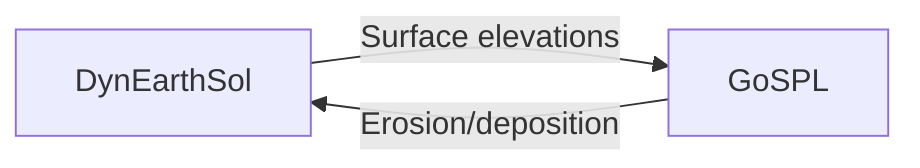

# Coupling DynEarthSol with GoSPL

This tutorial explains how to run DynEarthSol coupled with **GoSPL** (Global Scalable Paleo Landscape Evolution) to simulate the interaction between tectonic deformation and surface processes like erosion and sediment transport.

## What is GoSPL?

[GoSPL](https://github.com/Geodels/gospl) is a Python-based landscape evolution model that simulates:
- River incision and sediment transport
- Hillslope diffusion
- Marine deposition
- Flexural isostasy

When coupled with DynEarthSol, you can study how tectonic processes (uplift, extension, compression) interact with surface erosion over geological timescales.

## Prerequisites

Before starting, ensure you have:

- ✅ GoSPL installed through conda. 
- ✅ `gospl_extensions`
- ✅ DynEarthSol compiled with GoSPL support

### Install GoSPL
Recommended by GoSPL users. Refer to https://gospl.readthedocs.io/en/latest/getting_started/installConda.html.

### Install gospl_extensions
```
git clone https://github.com/GeoFLAC/gospl_extensions.git
cd gospl_extensions/cpp_interface
make install-local
```
:::tip Check your build
You will see this message if successful:
```
Installing locally for DynEarthSol integration...
✅ Installed locally to gospl_extensions/lib and gospl_extensions/include
```
:::

### Build DynEarthSol with GoSPL support

1. Set `use_gospl = 1` in Makefile.
2. Set `GOSPL_EXT_DIR`: e.g., `GOSPL_EXT_DIR = $(HOME)/opt/gospl_extensions`
3. Run `make`.

:::tip Check your build
When the build is successful, you should see the following message:
```
==============================================
✅ DynEarthSol built with GoSPL support!
==============================================
🚀 To run with GoSPL support:

Use the wrapper script (PYTHONPATH is set automatically):
  ./dynearthsol-gospl your_input.cfg

Or set PYTHONPATH manually and use the regular executable:
  PYTHONPATH=/home/auser/opt/gospl_extensions/cpp_interface:$PYTHONPATH ./dynearthsol3d your_input.cfg
==============================================
```
:::

## Quick Start

### Step 1: Enable GoSPL in your configuration

| Parameter | Default | Description |
|-----------|---------|-------------|
| `surface_process_option` | 0 | Set to **11** to enable GoSPL |
| `surface_process_gospl_config_file` | — | Path to your GoSPL YAML file |
| `gospl_coupling_frequency` | 1 | How often to run GoSPL (every N steps) |
| `gospl_mesh_resolution` | -1 | Grid spacing in meters (-1 = automatic) |
| `gospl_initial_topo_amplitude` | 0.0 | Initial random topography (m) |
| `gospl_mesh_perturbation` | 0.3 | Grid randomization (0–1) |

:::info Coupling frequency tip
For models with slow erosion rates, you can set `gospl_coupling_frequency = 100` or higher to speed up computation. GoSPL will run less often but with accumulated time.
:::

```cfg title="my_simulation.cfg"
[control]
surface_process_option = 11
surface_process_gospl_config_file = gospl_config.yml
gospl_coupling_frequency = 100 # Run GoSPL every 100th DynEarthSol time step
gospl_mesh_resolution = 500 # in meters
gospl_initial_topo_amplitude = 0.0  # in meters. 0.0: initially flat
gospl_mesh_perturbation = 0.3       # Perturbation amount: 30 % of +/-0.5 times the grid spacing
```

### Step 2: Create a GoSPL configuration file

Create a YAML file for GoSPL settings:

```yaml title="gospl_config.yml"
name: coupled_simulation

domain:
    npdata: ['./gospl_mesh','v','c','z']
    flowdir: 1
    seadepo: False
    bc: '1000'

output:
    dir: 'coupling_test' # Output directory

time:
  start: 0.0
  end: 1000000.0   # 1 Myr
  tout: 5000.0     # 5 kyr output interval
  dt: 1000.0       # 1 kyr time step (to be overwritten by DynEarthSol)

spl:
    K: 4.e-7
    d: 0.
    m: 0.4

diffusion:
    hillslopeKa: 0.02
    hillslopeKm: 0.1

sea:
    position: -10.

climate:
  - start: 0.
    uniform: 1
```

### Step 3: Run your simulation

```bash
./dynearthsol-gospl my_simulation.cfg
```

DynEarthSol will automatically:
1. Generate a mesh for GoSPL at startup
2. Exchange elevation data between the two models
3. Apply erosion/deposition changes to the DynEarthSol surface

In this example, 
- the mesh is generated automatically and saved as `gospl_mesh.npz` in your working directory.
- DynEarthSol outputs will be saved in the working directory.
- GoSPL outputs will be saved in the `coupling_test` directory. 


## Example: Extensional Basin with Erosion

Here's a complete example for modeling extension with surface processes:

```cfg title="extension_with_erosion.cfg"
[sim]
modelname = extension_erosion
max_time_in_yr = 500000
output_time_interval_in_yr = 10000

[mesh]
xlength = 100e3
ylength = 50e3
zlength = 30e3
resolution = 2e3

[control]
# Enable GoSPL coupling
surface_process_option = 11
surface_process_gospl_config_file = gospl_config.yml
gospl_coupling_frequency = 100
gospl_mesh_resolution = 1000

[bc]
vbc_x0 = 1
vbc_x1 = 1
vbc_val_x0 = -5e-10   # Extension
vbc_val_x1 = 5e-10

[mat]
rheology_type = elasto-plastic
rho0 = [2700]
# ... other material properties
```

<!-- ## How the Coupling Works

The coupling follows a **two-way exchange** pattern:



1. **DynEarthSol** computes mechanical deformation (stresses, velocities, displacements)
2. **GoSPL** receives current surface elevations and computes erosion/deposition
3. **Elevation changes** are applied back to DynEarthSol surface nodes

:::note Mesh generation
At startup, DynEarthSol automatically creates a triangular mesh for GoSPL based on your model domain. The mesh is saved as `gospl_mesh.npz` in your working directory.
::: -->

## Troubleshooting

### "GoSPL not initialized" error

**Cause:** GoSPL Python package not found.

**Solution:** Ensure GoSPL is installed:
```bash
pip install gospl
```

### "Cannot find gospl_config.yml"

**Cause:** Configuration file path is incorrect.

**Solution:** Use an absolute path or ensure the file is in your working directory:
```cfg
surface_process_gospl_config_file = /full/path/to/gospl_config.yml
```

### Simulation runs slowly

**Cause:** GoSPL is being called every time step.

**Solution:** Increase the coupling frequency:
```cfg
gospl_coupling_frequency = 200
```

## Next Steps

- Learn about [GoSPL configuration options](https://gospl.readthedocs.io/)
- See the [example configurations](https://github.com/echoi/DynEarthSol/tree/master/gospl_driver/examples)
- Read the technical details in [`GOSPL_COUPLING.md`](../GOSPL_COUPLING.md)
