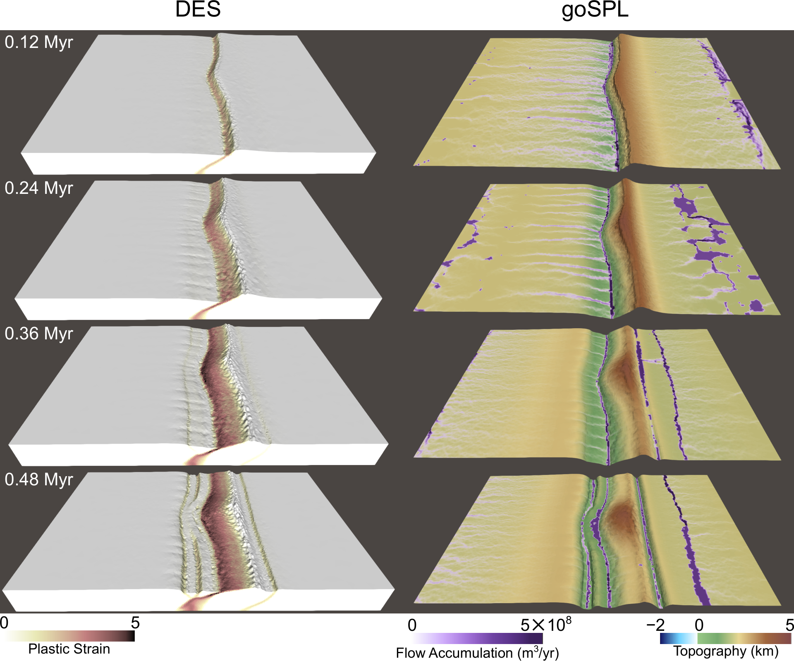

# Coupling DynEarthSol with GoSPL

This tutorial explains how to run DynEarthSol coupled with **GoSPL** (Global Scalable Paleo Landscape Evolution) to simulate the interaction between tectonic deformation and surface processes like erosion and sediment transport.

## What is GoSPL?

[GoSPL](https://github.com/Geodels/gospl) is a Python-based landscape evolution model that simulates:
- River incision and sediment transport
- Hillslope diffusion
- Marine deposition
- Flexural isostasy

When coupled with DynEarthSol, you can study how tectonic processes (uplift, extension, compression) interact with surface erosion over geological timescales.

## Prerequisites

Before starting, ensure you have:

- ✅ GoSPL installed through conda, with Python 3.11 in the environment
  (by default at `~/miniconda3/envs/gospl`)
- ✅ `gospl_extensions`
- ✅ DynEarthSol compiled with GoSPL support (the source tree must include the
  `gospl_driver` directory), which needs a C++ toolchain and `make`

### Install GoSPL through conda
Recommended by GoSPL users. Refer to https://gospl.readthedocs.io/en/latest/getting_started/installConda.html.

### Install gospl_extensions

GoSPL is written in Python and DynEarthSol in C++. `gospl_extensions` is the
bridge between them. It provides:

- a **C++ entry point**: `libgospl_extensions.so` and a header, so DynEarthSol
  can drive a Python model from compiled code;
- **`EnhancedModel`**: a GoSPL subclass that can be stepped externally, take
  imposed velocities and hand back an elevation change;
- **interpolation** between the DES mesh and the GoSPL mesh, which are built
  independently and at different resolutions.

```
git clone https://github.com/GeoFLAC/gospl_extensions.git
cd gospl_extensions/cpp_interface
conda activate gospl
make install-local
```
:::tip Check your build
You will see this message if successful:
```
Installing locally for DynEarthSol integration...
✅ Installed locally to gospl_extensions/lib and gospl_extensions/include
```
:::

### Build DynEarthSol with GoSPL support

1. Set `use_gospl = 1` in Makefile.
2. Set `GOSPL_EXT_DIR`: e.g., `GOSPL_EXT_DIR = $(HOME)/opt/gospl_extensions`
3. Set `ndims = 3`, which is **required** for the GoSPL coupling.
4. Set `usemmg = 1`, which is **recommended**: MMG mesh optimization during
   remeshing (see [Adaptive mesh refinement with MMG](./usingmmg)).
5. Build **outside** the gospl environment, which keeps the compiler off
   conda's libraries:
   ```bash
   conda deactivate   # if any environment is active
   make clean
   make -j4
   ```

:::tip Check your build
When the build is successful, you should see the following message:
```
==============================================
✅ DynEarthSol built with GoSPL support!
==============================================
🚀 To run with GoSPL support:

Use the wrapper script (PYTHONPATH is set automatically):
  ./dynearthsol-gospl your_input.cfg

Or set PYTHONPATH manually and use the regular executable:
  PYTHONPATH=/home/auser/opt/gospl_extensions/cpp_interface:$PYTHONPATH ./dynearthsol3d your_input.cfg
==============================================
```
:::

### Verify the build

Run these four checks before moving on:

```bash
./dynearthsol3d --help | grep gospl                # options registered?
conda activate gospl && python -c "import gospl"   # GoSPL importable?
ldd dynearthsol3d | grep python                    # linked to Python?
cat dynearthsol-gospl                              # wrapper script written?
```

The build also writes `dynearthsol-gospl`, a wrapper script that sets
`PYTHONPATH` for you. If it is missing, the build did not complete with
`use_gospl = 1`.

## How coupling works

DES3D and GoSPL exchange data following the **ASPECT-FastScape simple
coupling scheme**:

1. **DES → GoSPL:** At each coupling event, DES passes time-averaged
   surface velocities to GoSPL. The velocity is $\overline{v} = \Delta
   \mathrm{coord} / \Delta t$, where $\Delta\mathrm{coord}$ is the
   displacement of each surface node since the *previous* coupling event and
   $\Delta t$ is the model time elapsed since then. Time-averaging filters
   out quasi-dynamic inertial oscillations that would otherwise perturb
   GoSPL's drainage network. The first event has no previous event, so it
   uses the instantaneous velocity.
2. **GoSPL → DES:** GoSPL advances by $\Delta t$: it applies the
   velocities (horizontal advection and vertical uplift), river incision and
   hillslope diffusion, and returns an elevation change $\Delta h$ at
   every surface node.
3. **Tectonic uplift accounting:** $\Delta h$ contains *only* the erosion
   and diffusion component. GoSPL subtracts the uplift
   ($v_z \Delta t$) before returning it, because DES already applied the
   same displacement through its Lagrangian mechanical solver; returning
   the full change would count the tectonic uplift twice. DES adds
   $\Delta h$ to the z-coordinates of its surface nodes. Note that
   $\Delta h$ is not $\Delta\mathrm{coord}_z$: $\Delta\mathrm{coord}_z$
   is DES's tectonic displacement, while $\Delta h$ is the surface-process
   change added on top of it.
4. **Persistent drainage state:** GoSPL's river network state is
   preserved across DES remeshing events so that drainage divides are
   not reset after mesh adaptation.
5. **Padded GoSPL mesh:** The GoSPL mesh extends beyond the DES domain
   by a configurable padding fraction (`gospl_mesh_padding`, default
   0.1) to avoid edge artifacts during extension.

One coupling event, between the previous event at $t_\mathrm{prev}$ and the
current one at $t_\mathrm{now}$ (`gospl_coupling_frequency` DES steps apart in
`steps` mode):

```
 DES time    t_prev   ────────── DES steps ──────────    t_now
               │                                           │
               │◄────────── Δt = t_now − t_prev ──────────►│
               │                                           │
          coord_prev                                   coord_now
               └───── Δcoord = coord_now − coord_prev ─────┘

 At t_now:

   DES ───────── v̄ = Δcoord / Δt  (vx, vy, vz) ─────────►  GoSPL
                                                             │  advances Δt:
                                                             │  advection, uplift,
                                                             │  incision, diffusion
   DES ◄──── Δh (erosion + diffusion, uplift removed) ───────┘

   DES then sets   z_surface ← z_surface + Δh
```

### What crosses the interface

| Direction | What is passed | Driver call |
|-----------|----------------|-------------|
| DES → GoSPL, once | Initial surface elevation, seeding GoSPL's `hGlobal` | `apply_elevation_data()` |
| DES → GoSPL, each event | Time-averaged surface velocity (vx, vy, vz) | `set_surface_velocity()` |
| GoSPL → DES, each event | Elevation change from erosion and diffusion only | `run_and_get_erosion()` |
| GoSPL → DES, on demand | Current elevation at any query point | `interpolate_elevation_to_points()` |

You never call these directly, but knowing the names makes the log output
readable.

### Coupling modes

| `gospl_coupling_mode` | Trigger parameter | Meaning |
|-----------------------|-------------------|---------|
| `steps` (default) | `gospl_coupling_frequency` | GoSPL runs every N DES steps |
| `time` | `gospl_coupling_interval_in_yr` | GoSPL runs every T model years |

### Known limitations

- **The coupling interval is a trigger, not a clamp.** In `time` mode,
  `gospl_coupling_interval_in_yr` only decides *when* coupling fires. The
  `dt` handed to GoSPL is the time accumulated since the last event, so if
  DES's adaptive time step exceeds the interval, coupling fires every DES
  step and GoSPL's step silently becomes DES's `dt`. There is no
  sub-stepping or truncation back to the nominal interval.
- **Remeshing between coupling events.** The coupling clock is unaffected
  by remeshing, and GoSPL's elevation state is not re-seeded from DES
  afterwards (GoSPL owns the topography). However, the time-averaged
  velocity only guards against a change in the *number* of surface nodes
  across a remesh. If a remesh leaves that count unchanged (common when
  only the interior remeshes), node identity is not verified and the
  velocity for the next coupling event can difference unrelated nodes.
  Treat the first coupling event after a remesh with caution.
- **The GoSPL mesh is fixed at startup.** It is generated once, sized to the
  DES model's *initial* top surface plus `gospl_mesh_padding` on each side,
  and never regenerated (on restart an existing mesh file is reused as is).
  The padding fraction therefore bounds how much lateral extension the DES
  model can accumulate before its surface approaches the GoSPL mesh
  boundary, where edge artifacts can reappear. Nothing warns you when this
  happens, so choose a generous `gospl_mesh_padding` for strongly extensional
  models.

## Quick Start

### Step 1: Enable GoSPL in your configuration

| Parameter | Default | Description |
|-----------|---------|-------------|
| `surface_process_option` | 0 | Set to **11** to enable GoSPL |
| `surface_process_gospl_config_file` | — | Path to your GoSPL YAML file |
| `gospl_coupling_mode` | `steps` | `steps` or `time` — controls what the coupling interval means |
| `gospl_coupling_frequency` | 1 | GoSPL runs every N DES steps (used when `gospl_coupling_mode = steps`) |
| `gospl_coupling_interval_in_yr` | — | GoSPL runs every T model years (used when `gospl_coupling_mode = time`) |
| `gospl_velocity_coupling` | `true` | Pass surface velocities to GoSPL for smoother drainage-network evolution |
| `gospl_mesh_resolution` | -1 | GoSPL grid spacing in meters (-1 = automatic) |
| `gospl_mesh_padding` | 0.1 | Fractional domain padding for GoSPL mesh (avoids boundary artifacts) |
| `gospl_initial_topo_amplitude` | 0.0 | Initial random topography (m) |
| `gospl_mesh_perturbation` | 0.3 | Grid randomization (0–1) |

:::info Coupling frequency tip
For models with slow erosion rates, you can set `gospl_coupling_frequency = 100` or higher to speed up computation. GoSPL will run less often but with accumulated time. Alternatively, use `gospl_coupling_mode = time` to couple at fixed model-time intervals regardless of step size.
:::

```cfg title="my_simulation.cfg"
[control]
surface_process_option = 11
surface_process_gospl_config_file = gospl_config.yml
gospl_coupling_mode = steps
gospl_coupling_frequency = 100      # Run GoSPL every 100th DynEarthSol time step
gospl_velocity_coupling = true      # Pass surface velocities to GoSPL
gospl_mesh_resolution = 500         # in meters
gospl_mesh_padding = 0.1            # extend GoSPL mesh 10 % beyond DES domain
gospl_initial_topo_amplitude = 0.0  # in meters. 0.0: initially flat
gospl_mesh_perturbation = 0.3       # 30 % of random perturbations, +0.5/-0.5 x h
```

### Step 2: Create a GoSPL configuration file

Create a YAML file for GoSPL settings. The coupling uses the `EnhancedModel`
from `gospl_extensions`, not stock GoSPL, so a standard GoSPL configuration may
not work. Start from the template below or from the
[bundled example](#worked-example-a-gaussian-weak-zone-rift), and keep these
five sections: `domain`, `time`, `spl`, `diffusion` and `output`.

```yaml title="gospl_config.yml"
name: coupled_simulation

domain:
    npdata: ['./gospl_mesh','v','c','z']
    flowdir: 1
    seadepo: False
    bc: '1000'

output:
    dir: 'coupling_test' # Output directory

time:
  start: 0.0
  end: 1000000.0   # 1 Myr
  tout: 5000.0     # 5 kyr output interval
  dt: 1000.0       # 1 kyr time step (to be overwritten by DynEarthSol)

spl:
    K: 4.e-6
    d: 0.
    m: 0.4

diffusion:
    hillslopeKa: 0.2
    hillslopeKm: 1.0

sea:
    position: -10.

climate:
  - start: 0.
    uniform: 1
```

The keys you will change most often:

| Key in the YAML | What it sets |
|-----------------|--------------|
| `spl: K` | Bedrock river incision rate (erodibility) |
| `spl: m`, `spl: n` | Drainage-area and slope exponents of the stream power law |
| `diffusion: hillslopeKa` | Hillslope diffusivity, m²/yr |
| `domain: flowdir` | Flow routing (`6` is multi-direction) |
| `domain: bc` | Boundaries, in the order S, E, N, W: `0` open, `1` closed. `'1010'` opens east and west |
| `domain: seadepo` | Marine deposition on or off |
| `sea: position` | Sea level in metres relative to the initial surface |

### Step 3: Run your simulation

Run from the directory that holds the GoSPL YAML: the path in
`surface_process_gospl_config_file` is resolved relative to the working
directory, not to the `.cfg` file.

```bash
./dynearthsol-gospl my_simulation.cfg
```

DynEarthSol will automatically:
1. Generate a mesh for GoSPL at startup
2. Exchange elevation data between the two models
3. Apply erosion/deposition changes to the DynEarthSol surface

In this example, 
- the mesh is generated automatically and saved as `gospl_mesh.npz` in your working directory.
- DynEarthSol outputs will be saved in the working directory.
- GoSPL outputs will be saved in the `coupling_test` directory. 

## Worked example: a Gaussian weak zone rift

The [`gospl_driver/examples`](https://github.com/GeoFLAC/DynEarthSol/tree/master/gospl_driver/examples)
directory holds a ready-to-run pair of files: a DES config,
`gaussian-weakzone-3d-with-gospl.cfg`, and its GoSPL YAML,
`gospl_config_gaussian_weakzone_3D.yml`. The parameters were chosen to match
an ASPECT + FastScape reference model, so the results are comparable to
published work.

| | Setting |
|---|---|
| Domain | 100 × 80 × 10 km, 1 km base mesh resolution, GoSPL mesh at 500 m |
| Forcing | ±1.5 cm/yr extension in x; a Gaussian weak zone seeds the rift |
| Duration | 1 Myr, output every 20 kyr, coupling every 200 steps |
| Surface law | `K = 1e-5`, `m = 0.4`, `n = 1`, hillslope `Ka = 1e-2` m²/yr |
| Boundaries | East and west open, north and south closed (`bc: '1010'`) |
| Sea level | −2000 m, so marine processes stay inactive |

### Exercise 1: run the reference case

```bash
conda activate gospl
cd DynEarthSol/gospl_driver/examples   # the YAML path resolves from here
../../dynearthsol-gospl ./gaussian-weakzone-3d-with-gospl.cfg
```

If you prefer to manage the environment yourself, set `PYTHONPATH` and use the
same command:

```bash
conda activate gospl
export PYTHONPATH="$HOME/opt/gospl_extensions/cpp_interface:${PYTHONPATH}"
cd DynEarthSol/gospl_driver/examples
../../dynearthsol-gospl ./gaussian-weakzone-3d-with-gospl.cfg
```

Watch for the coupling messages in the log. Output is written to
`output_gaussian_weakzone_3D/` every 20 kyr.



Things to look for as the run proceeds:

- a rift valley opening above the weak zone, with uplifted flanks;
- channels organizing down those flanks as the relief grows;
- sediment accumulating in the axial low.

### Exercise 2: vary the erodibility

Change one line in the YAML, `spl: K`, and rerun. Nothing needs rebuilding.

| Run | `spl: K` | What you should see |
|-----|----------|---------------------|
| Reference | `1.0e-5` | Rivers keep pace with uplift; moderate flank relief |
| Weak erosion | `1.0e-6` | Tectonics dominates: higher, sharper flanks, little sediment |
| Strong erosion | `1.0e-4` | Flanks worn down as they rise; the valley fills faster |

As an optional second experiment, set `gospl_coupling_frequency = 50` in the
`.cfg` and check whether the result changes. If it does, the coupling interval
was too coarse.

Change one parameter at a time, and keep a log of what you changed.


## Troubleshooting

### Build errors

| Message | Cause and fix |
|---------|---------------|
| `cannot find -lpython3.11` | Wrong conda path. Make sure the `gospl` environment exists at `~/miniconda3/envs/gospl` with Python 3.11, or update `CONDA_ENV_PATH` in the Makefile |
| `cannot find -lgospl_extensions` | Extensions built elsewhere. Update `GOSPL_EXT_DIR` in the Makefile |
| `gospl-driver.hpp: No such file` | `gospl_driver` is not in the DynEarthSol source directory |

### Runtime errors

| Message | Cause and fix |
|---------|---------------|
| `GoSPL not initialized`, or an `ImportError` for `gospl` | The GoSPL Python package was not found. Activate the environment: `conda activate gospl` |
| `No module named 'gospl_python_interface'` | Add the `gospl_extensions/cpp_interface` directory to `PYTHONPATH`, or use the `dynearthsol-gospl` wrapper |
| `The input file is not found`, or `Cannot find gospl_config.yml` | Run from the directory that holds the YAML, or use an absolute path |

Most of these come from a path assumption. Nearly all are fixed by editing a
directory variable in the Makefile or by changing directory before running. To
avoid depending on the working directory, use an absolute path:
```cfg
surface_process_gospl_config_file = /full/path/to/gospl_config.yml
```

### Intermittent PETSc error

```
Error in run_and_get_erosion: error code 77
[0] Unexpected state: bad hmax in TSAdaptChoose()
Error: GoSPL run_and_get_erosion failed
```

**Cause:** a floating-point edge case in PETSc's adaptive time stepper inside
GoSPL's marine deposition solver. The run recovers: DynEarthSol skips applying
erosion for that one step.

**Avoiding it:** if sea level is well below the model surface, marine
deposition is inactive anyway. Set `seadepo: false` in the GoSPL YAML to skip
that code path entirely. Do this only when sea level is far below the surface,
as it is in the worked example.

### Simulation runs slowly

**Cause:** GoSPL is being called every time step.

**Solution:** Increase the coupling frequency:
```cfg
gospl_coupling_frequency = 200
```

## Next Steps

- Copy the example pair to start your own model, rather than writing configs from scratch
- Learn about [GoSPL configuration options](https://gospl.readthedocs.io/)
- See the [example configurations](https://github.com/GeoFLAC/DynEarthSol/tree/master/gospl_driver/examples) and their README for the parameter rationale
- Read [`gospl_driver/README.md`](https://github.com/GeoFLAC/DynEarthSol/tree/master/gospl_driver/README.md) for the coupling in detail
- Read the technical details in [`GOSPL_COUPLING.md`](https://github.com/GeoFLAC/DynEarthSol/tree/master/gospl_driver/GOSPL_COUPLING.md)
