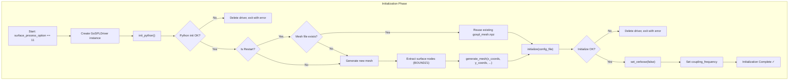
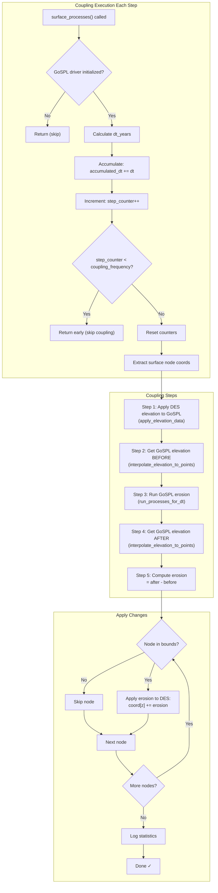
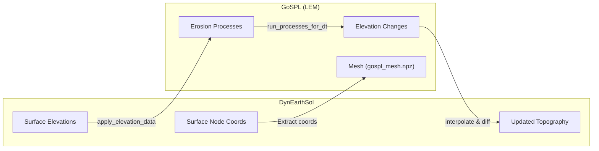

# GoSPL Coupling Flowchart

This diagram shows the initialization and execution flow of the DynEarthSol-GoSPL coupling.

## Initialization Flow (in `dynearthsol.cxx`)

## Execution Flow (in `bc.cxx::use_gospl`)

## Complete Data Flow

## Key Components

| Component | File | Purpose |
|-----------|------|---------|
| `GoSPLDriver` | [gospl-driver.cxx](file:///home/echoi2/opt/DynEarthSol/gospl_driver/gospl-driver.cxx) | C++ wrapper for GoSPL Python interface |
| Initialization | [dynearthsol.cxx:547-616](file:///home/echoi2/opt/DynEarthSol/dynearthsol.cxx#L547-L616) | GoSPL driver setup in main() |
| Coupling Logic | [bc.cxx:1589-1719](file:///home/echoi2/opt/DynEarthSol/bc.cxx#L1589-L1719) | `use_gospl()` function for each step |
| Cleanup | [dynearthsol.cxx:910-916](file:///home/echoi2/opt/DynEarthSol/dynearthsol.cxx#L910-L916) | Driver deletion at simulation end |
