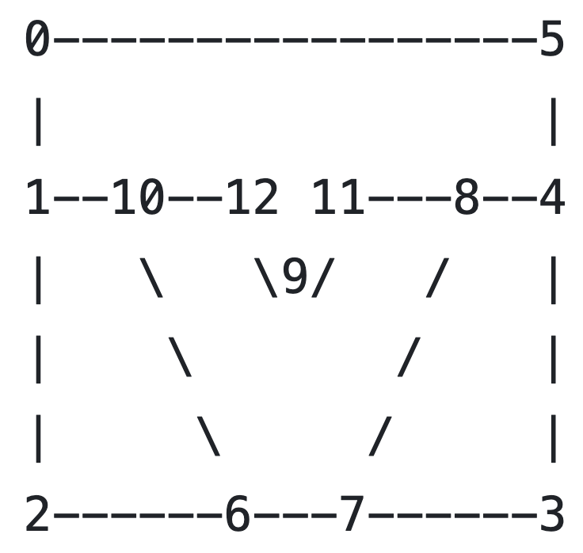

# Multi-Material Model

Currently, DES is only set-up to run one rheology at a time, so all
layers in a model must have the same rheology time (e.g.
elasto-visco-plastic or elasto-plastic). A multilayer example is
available in the folder `DynEarthSol/examples/` ; look at files
`rifting-2d.cfg` and `rifting-2d.poly`. The .poly file holds
information about the layer geometry and the configuration file tells
DES where to look for that information.

## In .cfg file

1.  In `[mesh]` section, specify `poly_filename`: e.g.,
```SHELL
poly_filename = rifting-2d.poly
```
2.  In `[mat]` section, specify `num_materials`: e.g.,
```SHELL
num_materials = 4
```
    - Provide as many values as `num_materials` for all the material properties (e.g. `rho0`, `lambda`, `mu`, etc): e.g.,
    ```SHELL
    rho0 = [ 2800, 2900, 3210, 3300 ]
    ```
    - We recommend you draw a schematic such as the one in `rifting-2d.poly` to illustrate your layers with labeled nodal points (shown below):
    

## In .poly file

In this file, you will define

- node coordinates
- segments connecting coordinates
- regions

1. **Node coordinates** As in the example .poly file, specify the
number of total nodes and number of dimensions. Then specify the node
number (starting from 0) and the x- and y-coordinates.

```SHELL
#### node coordinates ####
# npoints ndims 0 0
  13      2     0 0
# i    xi       yi
  0    0.0      0.0
  1    0.0    -35.0e3 
  2    0.0   -150.0e3 
  3  500.0e3 -150.0e3 
  4  500.0e3  -35.0e3
  5  500.0e3    0.0
  6  150.0e3 -150.0e3 
  7  350.0e3 -150.0e3
  8  380.0e3  -35.0e3
  9  250.0e3  -39.0e3
 10  120.0e3  -35.0e3
 11  300.0e3  -35.0e3
 12  200.0e3  -35.0e3
 ```

2. **Segments** As in the example .poly file, specify the number of
total segments connecting any 2 nodes. Then specify the segment number
(starting from 0) and the nodes it connects (e.g. in the picture of
rifting-2d.poly\'s scheme above, segment 0 connects nodes 0 and 1.
Segment 9 connects nodes 10 and 12.) Finally, assign a boundary flag.
Flags:

-   0: not a boundary
-   1: left boundary (x0)
-   2: right boundary (x1)
-   16: bottom boundary (z0)
-   32: top boundary (z1)

```SHELL
#### segments ####
# nsegments 1
  16        1
# j  pj0  pj1  bdry_flag
  0   0    1    1  #  1: left (x0)
  1   1    2    1
  2   2    6   16  # 16: bottom (z0)
  3   6    7   16
  4   7    3   16
  5   3    4    2  #  2: right (x1)
  6   4    5    2
  7   5    0   32  # 32: top (z1)
  8   1   10    0  #  0: not a boundary
  9  10   12    0
 10  12    9    0
 11   9   11    0
 12  11    8    0
 13   8    4    0
 14  10    6    0
 15   8    7    0
```
3. **Holes** In tectonic moeling, there is no reason to deal with an undergroun empty space.

```SHELL
#### holes, must be 0 ####
0
```

4. **Regions** As in the example .poly file, specify the number of
total regions. Then specify the region number (starting from 0) and a
point within that region (we recommend choosing a fairly central node
here). The `mattype` specifies which value in the .cfg file \[mat\]
paramter should be applied to the region. Finally, specify the max
element size (m\^2) for the region. If there is no upper limit on
element size, use `-1`.

```SHELL
#### regions ####
# nregions
  4
# k  xk    zk   mattype  size
  0 250e3 -20e3 0        2e7  # max. element size (in m^2)
  1 250e3 -80e3 1        4e7
  2   1e3 -80e3 1        -1   # no upper limit on elem size
  3 450e3 -80e3 1        -1
```
