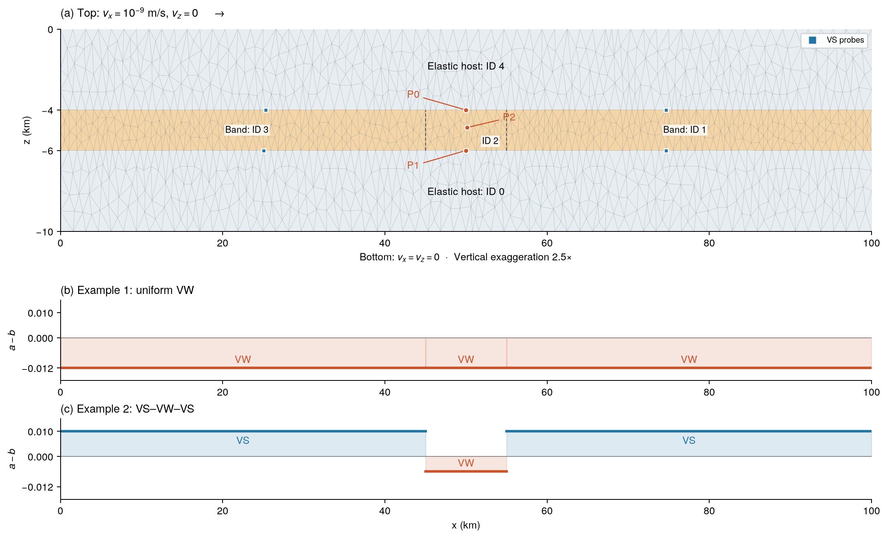
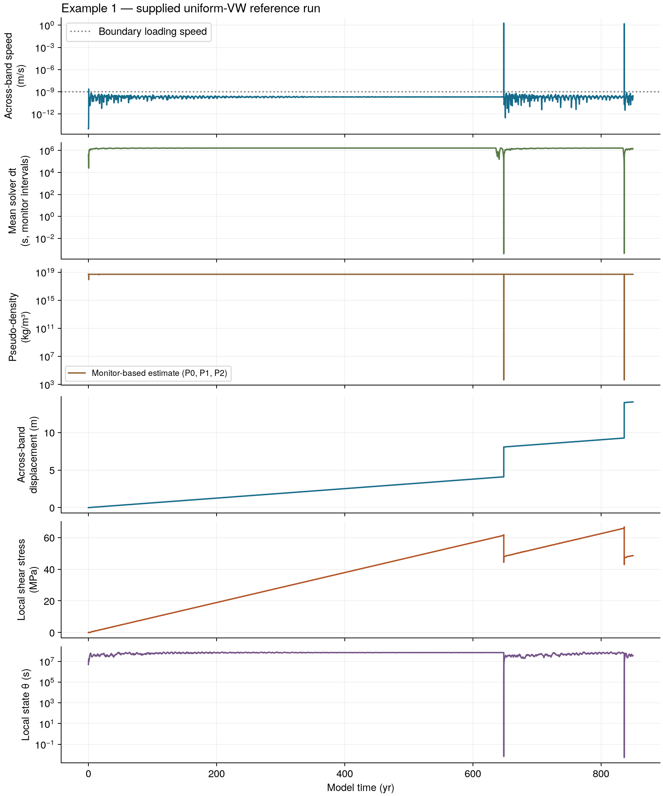
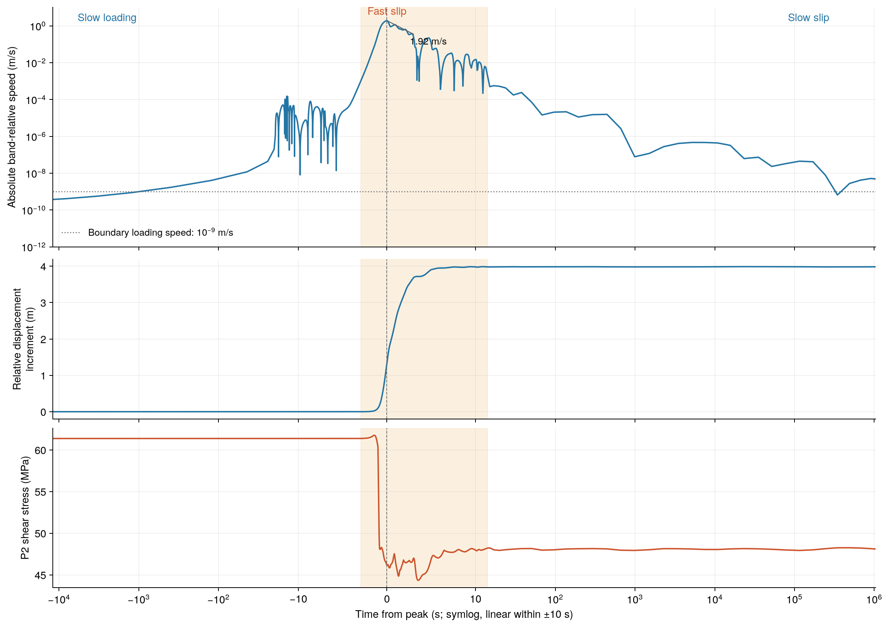
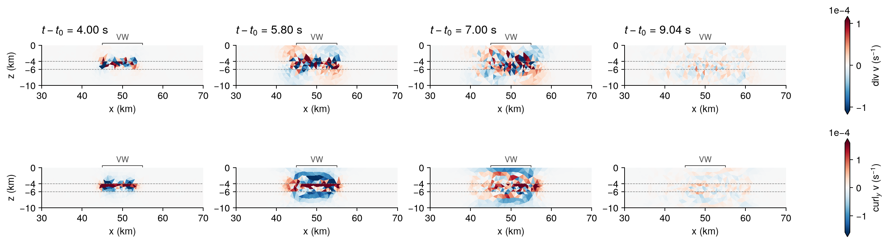
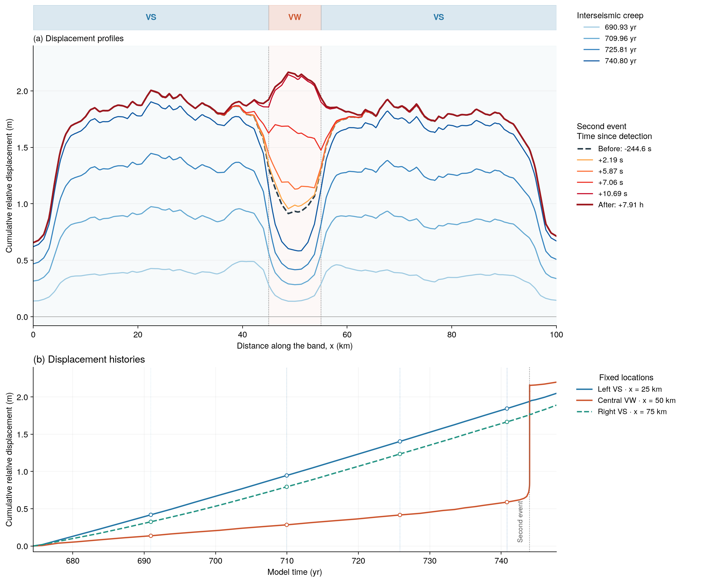

import useBaseUrl from '@docusaurus/useBaseUrl';

# Rate-and-state friction in a finite-width shear band

This tutorial uses two small 2D DynEarthSol models to follow slow loading,
rapid slip and recovery. You will run a uniform velocity-weakening (VW) band,
then compare it with a VW patch between velocity-strengthening (VS) flanks.
Five figures connect the model inputs to its time histories and spatial response.

## What is rate-and-state friction?

Rate-and-state friction describes resistance that depends on sliding rate and
a state variable, θ, which evolves with the deformation history. The parameters
`a` and `b` control the frictional response: at steady sliding, `a−b > 0` is
velocity strengthening and `a−b < 0` is velocity weakening. Velocity weakening
can promote instability; the surrounding stiffness, loading and state evolution
also matter.

Here frictional deformation occupies a **2 km thick band**, rather than an
infinitely thin fault. Our displacement measure is the horizontal displacement
of the upper band interface minus that of the lower interface. It includes
elastic deformation as well as localized inelastic deformation.

By the end, you should be able to connect a slip-speed peak to displacement
accumulation, stress release and a reduction in the solver time step, and explain
why the VS flanks creep while the central VW patch accumulates a displacement
deficit and then catches up.

## Prerequisites

Download and extract the <a href={useBaseUrl('/downloads/des-rsf/DES-RSF-Tutorial.zip')}>workshop files</a>. They contain
`Tutorial.ipynb`, a browser-readable `Tutorial.html`, model inputs, reference
outputs and the data behind the five figures.

Use Linux, macOS or Windows Subsystem for Linux (WSL). On Windows, run both DES
and Jupyter inside WSL. You need a C++ compiler, Make, Boost.Program_options,
HDF5 and Python 3.10 or later. HDF5 development headers and libraries are
required: this tutorial reads VTKHDF spatial fields, so keep `hdf5=1` when
building DES. Installing Python's `h5py` alone does not provide the system
development package needed to compile DES.

Install the dependencies for your operating system before building.

**Ubuntu 22.04 or later (including Ubuntu in WSL):**

```bash
sudo apt update
sudo apt install -y git g++ make libboost-program-options-dev libhdf5-dev pkg-config python3 python3-venv
```

**macOS:** install the Xcode Command Line Tools (`xcode-select --install`,
if not already installed) and [Homebrew](https://brew.sh/), then run:

```bash
brew install boost libomp hdf5 pkg-config python
```

`libomp` supplies the OpenMP runtime for Apple's compiler. The pinned DES
revision below automatically locates HDF5 on Ubuntu and macOS; do not pass
Ubuntu-specific `HDF5_INCLUDE_DIR` or `HDF5_LIB_DIR` paths on macOS.

### Build and check DES

This exercise was checked against the public DES revision
[`1b4e94f1c333fdade9dc512cf9cb20e10e8e9aad`](https://github.com/GeoFLAC/DynEarthSol/tree/1b4e94f1c333fdade9dc512cf9cb20e10e8e9aad).
Use a separate checkout so an existing working copy is preserved.

```bash
git clone --recursive https://github.com/GeoFLAC/DynEarthSol.git DynEarthSol-tutorial
cd DynEarthSol-tutorial
git checkout 1b4e94f1c333fdade9dc512cf9cb20e10e8e9aad
git submodule update --init --recursive
make config ndims=2 opt=2 openmp=1 hdf5=1
make -j2 ndims=2 opt=2 openmp=1 hdf5=1
export DYNEXE="$PWD/dynearthsol2d"
export OMP_NUM_THREADS=1
export OMP_DYNAMIC=FALSE
"$DYNEXE" --help
```

Check that `make config` reports `hdf5 1` and existing HDF5 include and library
directories for your installation. The same build commands work on Ubuntu and
macOS. Check that the help lists `rsf_slip_rate_projection_option`, `rsf_dtheta_max`
and `use_global_velocity_scaling`. The executable must be a 2D HDF5 build.
Keep this terminal open so `DYNEXE` remains defined. The mesh is small enough
that one OpenMP thread is appropriate.

**Only if HDF5 auto-detection fails:** first install the HDF5 development
package listed above. If it is installed but the build still cannot find it,
check its location and rerun the complete build command with explicit paths.
These overrides select an existing installation; they do not install HDF5.

On **Ubuntu x86_64**, the serial development package normally uses the paths
below. Verify them before building; other architectures can use a different
library directory.

```bash
ls /usr/include/hdf5/serial/H5Lpublic.h
ls /usr/lib/x86_64-linux-gnu/hdf5/serial/libhdf5.so
make -j2 ndims=2 opt=2 openmp=1 hdf5=1 \
  HDF5_INCLUDE_DIR=/usr/include/hdf5/serial \
  HDF5_LIB_DIR=/usr/lib/x86_64-linux-gnu/hdf5/serial
```

On **macOS with Homebrew**, use the installed formula's prefix:

```bash
ls "$(brew --prefix hdf5)/include/H5Lpublic.h"
ls "$(brew --prefix hdf5)/lib/libhdf5.dylib"
make -j2 ndims=2 opt=2 openmp=1 hdf5=1 \
  HDF5_INCLUDE_DIR="$(brew --prefix hdf5)/include" \
  HDF5_LIB_DIR="$(brew --prefix hdf5)/lib"
```

Each multi-line `make` block is one shell command: the trailing backslashes
continue it onto the next line. Keep the path assignments on that command;
do not run them as separate commands after `make`. Once the build succeeds,
continue with the `DYNEXE` exports and help check above.

### Prepare Python

Change to the extracted `DES-RSF-Tutorial` directory, then run:

```bash
export TUTORIAL_DIR="$PWD"
python3 -m venv .venv
source .venv/bin/activate
python -m pip install -r resources/requirements.txt
python -m jupyterlab
```

Open `Tutorial.ipynb` and a JupyterLab terminal (File → New → Terminal).
Run each example's `bash` block in that terminal; run its `python` block as a
notebook cell. In the terminal, run these three commands once before Example 1,
replacing the executable path with the absolute path from the build step:

```bash
export DYNEXE="/absolute/path/to/DynEarthSol-tutorial/dynearthsol2d"
export OMP_NUM_THREADS=1
export OMP_DYNAMIC=FALSE
```

A JupyterLab terminal normally inherits these variables if they were exported
before JupyterLab started. Repeating the commands makes the run settings explicit.
Keep this terminal for both examples; repeat the three commands if you open a
new terminal.

To study the results without running DES, use the supplied reference paths in
the notebook's setup cell. The reference figures and numerical data are included
in the download; no solver is needed for that route.

## How the model works

The model is 100 km wide and 10 km deep. A horizontal band lies between depths
of 4 and 6 km. The upper boundary moves in the positive x direction at
10⁻⁹ m/s and has zero vertical velocity; the bottom is fixed. The side boundaries
do not impose a velocity. Both examples use the same geometry and loading.



*Figure 1.* (a) Model geometry, boundary loading and monitor positions;
depth is exaggerated by 2.5×. P0 and P1 sample the upper and lower faces of the
band near x = 50 km, and P2 samples its interior. (b) Spatial distribution of
`a−b` in Example 1: the entire band is VW. (c) Spatial distribution of `a−b`
in Example 2: a central VW patch lies between VS flanks.

| Setting | Value |
| --- | --- |
| Domain / band thickness | 100 × 10 km / 2 km |
| Central patch | x = 45–55 km |
| Density / bulk modulus / shear modulus | 2700 kg/m³ / 50 GPa / 30 GPa |
| Band cohesion / characteristic distance | 4 MPa / 0.005 m |
| Reference and loading velocity | 10⁻⁹ m/s |
| Nominal mesh resolution | 400 m |
| Model duration | 850 years |

### Geometry, material IDs and friction

`decollement.poly` defines 14 vertices, 18 segments and five material regions.
The band order from left to right is **3–2–1**, while arrays in `[mat]` are
indexed by material ID **0,1,2,3,4**. The lower and upper hosts are IDs 0 and 4.
Their very large cohesion keeps them elastic in this exercise.

| Case / region | Material ID | a | b | a−b |
| --- | --- | ---: | ---: | ---: |
| Example 1: entire band | 1, 2, 3 | 0.003 | 0.015 | −0.012 |
| Example 2: left VS | 3 | 0.011 | 0.001 | +0.010 |
| Example 2: central VW | 2 | 0.011 | 0.017 | −0.006 |
| Example 2: right VS | 1 | 0.011 | 0.001 | +0.010 |

Both examples use `state_var_model=1` and the same characteristic distance.
The two cfg files already contain these assignments. The `.poly` vertices at
(50, −4) and (50, −6) km let P0/P1 match the interface at x = 50 km; they do
not introduce another material division. The annotated `resources/POLY_GUIDE.md`
in the download explains the point, segment and region blocks.

### What is measured?

P0 and P1 provide the signed across-band horizontal speed
`vx(P0) − vx(P1)`. Figures 2–3 show its absolute value,
`|vx(P0) − vx(P1)|`. Across-band displacement is calculated from the P0 and P1
horizontal coordinates as
`[x(P0,t) − x(P1,t)] − [x(P0,t_initial) − x(P1,t_initial)]`, where `t_initial`
is the first saved monitor sample. This retains the sign of displacement;
integrating the absolute speed would instead accumulate travel in both
directions. P2 provides local shear stress and θ.

Figure 5 instead interpolates displacement along both band interfaces at the
same initial x positions. This lets the spatial profiles and the VS/VW time
histories use exactly the same quantity.

## Quick start: run Example 1

### Step 1: prepare and inspect the inputs

Start in the extracted tutorial directory. Use a fresh run-directory name when
repeating a calculation; `mkdir` below deliberately stops if it already exists.

```bash
export TUTORIAL_DIR="$PWD"
mkdir -p "$TUTORIAL_DIR/results"
export RUN_DIR="$TUTORIAL_DIR/results/example1"
mkdir "$RUN_DIR" && mkdir "$RUN_DIR/output" && \
  cp resources/models/example1_uniform_vw.cfg resources/models/decollement.poly "$RUN_DIR/"
sed -n '/^\[mat\]/,/^\[monitor\]/p' "$RUN_DIR/example1_uniform_vw.cfg"
```

In `[sim]`, `max_time_in_yr=850` is physical model time.
`output_time_interval_in_yr=25` sets the normal field-save interval to 25 model
years; `output_step_interval=1000000` also requests a save after that many
solver steps. `earthquake_output_step_interval=1000` requests more frequent
fields during a detected rapid episode. In `[monitor]`, `step_interval=10`
saves monitor points every ten solver steps. These are output intervals, not
the solver's physical time step.

### Step 2: run DES and inspect its output

```bash
cd "$RUN_DIR"
"$DYNEXE" example1_uniform_vw.cfg
```

Wait for the solver to finish successfully. Confirm the startup log reports
one OpenMP thread. Then inspect the files:

```bash
head -n 2 output/monitor_point_0.csv
head -n 2 output/monitor_point_1.csv
head -n 2 output/monitor_point_2.csv
ls output/model.save.*.vtkhdf | head
printf 'Example 1 output: %s\n' "$RUN_DIR"
```

CSV coordinates and displacement use metres, velocities m/s, times seconds
and stresses Pa. Compare the requested `query_x/query_z` with the selected
`coord_x/coord_z`: P0/P1 should match x = 50000 m exactly, while P2 can use a
nearby interior mesh node. VTKHDF `save` files contain spatial fields;
`chkpt` files are restart checkpoints.

### Step 3: load the results in the notebook

The notebook starts in the tutorial directory, independently of the terminal's
current directory. Set `RUN` to your Example 1 output and `SECOND` to the
Example 2 directory you will create below. For the no-solver route, uncomment
the two reference assignments.

```python
from pathlib import Path
import sys
import numpy as np
import h5py
import matplotlib.pyplot as plt

ROOT = Path.cwd().resolve()
assert (ROOT / "resources/tutorial_tools.py").is_file(), "Open the notebook in the tutorial directory."
sys.path.insert(0, str(ROOT / "resources"))
import tutorial_tools as tt

RUN = ROOT / "results/example1"
SECOND = ROOT / "results/example2"
# RUN = ROOT / "resources/reference/example1_uniform_vw"
# SECOND = ROOT / "resources/reference/example2_vs_vw_vs"
FIGURES = ROOT / "resources/figures"
print(f"Example 1 analysis source: {RUN}")
print(f"Example 2 analysis source: {SECOND}")
```

```python
# Read monitor CSVs: P0-P1 relative horizontal velocity/displacement,
# plus P2 shear stress, state variable and friction histories.
history = tt.band_history(RUN)
# Find |vx(P0) - vx(P1)| >= 1e-3 m/s (1 mm/s).
# Group exceedances separated by at most 86400 s (one model day).
events = tt.find_events(history)
for number, event in enumerate(events, start=1):
    print(f"Event {number}: {event['start_yr']:.3f} yr; "
          f"peak speed {event['peak_relative_speed']:.3f} m/s")
```

`start_yr` is the first saved threshold-exceeding time in each group;
`peak_relative_speed` is its largest sampled absolute relative speed.
This is an analysis criterion, separate from DES's internal rapid-output
trigger, not a physical definition of an earthquake. It measures motion at
P0/P1, not every slipping region in the model, and can miss peaks between
saved samples. The defaults are `threshold=1e-3` and `merge_gap_s=86400`;
the plotting helpers below use those same defaults internally.

The five numbered figures below are supplied reference figures. The plotting
cells create additional figures from the directories selected by `RUN` and
`SECOND`; selecting reference paths deliberately plots the supplied runs.
The basic workshop saves fewer spatial fields than the figure-generation
runs, so compare physical trends and actual saved times before expecting a
matching image. Python plotting is provided; the exercises focus on interpreting
and comparing results.

The supplied Example 1 has two detected episodes, near 648.255 and 836.241
years. Here an episode groups crossings of an across-band speed of 10⁻³ m/s;
this analysis threshold is distinct from DES's automatic output trigger.

## Worked example 1: from loading to rapid slip

### Read the full history



*Figure 2.* Six panels from the supplied Example 1 reference run. Read
vertically at each event: speed rises, mean solver dt shrinks, estimated
pseudo-density decreases, displacement increases abruptly, and shear stress
drops. Stress then reloads. The dt curve uses monitor-interval averages;
pseudo-density is estimated from the largest speed at the three monitor
points. All six panels use monitor CSV data and the run's material/control
settings, without reading spatial field files.

Plot the same six panels from `RUN` on a shared model-time axis: speed, mean
solver time step, pseudo-density, displacement, stress and state.
`plot_history` calculates the
mean time step as `diff(time_s) / diff(step)` between consecutive monitor
records and plots it at each interval's midpoint. The workshop records every
10 solver steps, so this is an interval average, not an individual step's dt.
It resolves the time-step trend more densely than the spatial field saves,
but can smooth short-lived extrema. Both the supplied Figure 2 and your plot
use this same monitor-based calculation.

The pseudo-density panel represents numerical inertia from mass scaling,
not physical rock density. `pseudo_density_samples(history)` uses the run's
cfg and estimates the global speed as the largest vector speed
`sqrt(vx**2 + vz**2)` at P0, P1 and P2, floored by the prescribed boundary-speed
bound. This is different from the across-band relative speed used to detect
events. It then applies `rho_pseudo = K / min(S * V_est, sqrt(M / rho))**2`,
where `S` is `inertial_scaling`, `rho` is the configured constant `rho0`, and `M` is the
shear modulus by default, or the bulk modulus for
`mass_scaling_reference_speed=bulk`. The helper requires uniform elastic
moduli and physical density, as in these workshop models.

With the workshop's default shear-speed ceiling, `K=50 GPa`, `G=30 GPa`
and `rho=2700 kg/m³`, pseudo-density cannot fall below `rho*K/G=4500 kg/m³`.
The solver uses the global maximum element-mean speed; three monitor points
only approximate that value and can miss motion elsewhere. The curve is
therefore labeled **monitor-based estimate**, not an exact record of solver
pseudo-density. It provides a densely sampled view of mass-scaling changes.
Mean dt alone cannot determine pseudo-density because other constraints,
including the RSF state limit, also control dt.

```python
# Plot speed, mean dt, monitor-estimated pseudo-density, displacement, stress and theta.
fig = tt.plot_history(history, title=f"Example 1 — {RUN.name}")
plt.show()
```

Rebuild the supplied Figure 2 (PNG/PDF) and its numerical CSV data with
`python resources/plot_history_figure.py` from the extracted tutorial directory.
It uses the bundled reference run; your notebook uses `RUN`. Compare actual
monitor sample times and physical trends when runs differ.

### Follow one complete event



*Figure 3.* Time is measured from the sampled speed peak. The continuous
symlog axis is linear within ±10 s and logarithmic outside, so both slow tails
and the rapid interval remain visible. Shading spans the first to last
10⁻³ m/s threshold exceedance in this episode.

The sampled peak reaches approximately 1.92 m/s. Most displacement accumulates
while the band moves rapidly and stress is released; the recovery continues
well beyond the rapid interval. Equal distances along this time axis are not
equal durations.

```python
EVENT_INDEX = 0  # Set to 1 for the second detected episode.
assert EVENT_INDEX < len(events), "No such detected episode; inspect the full history first."
event = events[EVENT_INDEX]
time_from_peak = history["time_s"] - event["peak_time_s"]
print(f"Sampled peak speed: {event['peak_relative_speed']:.3f} m/s")
print(f"Threshold-crossing envelope: {event['span_s']:.3f} s")
print(f"Local stress drop to the low-rate recovery sample: "
      f"{event['local_shear_stress_drop_mpa']:.2f} MPa")
```

Plot the selected episode from `RUN`. This helper shows a short window around
the threshold-crossing interval on a linear time axis; Figure 3 uses a longer
symlog window to show loading and recovery. The displacement here is zero at
the first threshold-crossing sample.

```python
# Plot the selected event from 10 s before its first exceedance to 10 s
# after its last; time zero is the sampled speed peak (default detection).
fig_event = tt.plot_event(history, event_index=EVENT_INDEX)
fig_event.suptitle(f"Example 1 — {RUN.name}; event {EVENT_INDEX + 1}")
plt.show()
```

**Exercise 1.** Identify the loading, rapid-slip and recovery intervals in
Figures 2–3 and the rapid-slip interval in your plotted event. Then set
`EVENT_INDEX=1` and rerun the event cells to compare the second episode. Two episodes
give one observed interval, not a recurrence distribution.

## Worked example 2: a VW patch between VS flanks

### Change the frictional contrast

The second cfg changes the band friction values while preserving geometry,
loading, cohesion and characteristic distance. The relevant arrays are:

```ini
direct_a = [0.003, 0.011, 0.011, 0.011, 0.003]
evolution_b = [0.015, 0.001, 0.017, 0.001, 0.015]
```

The centre is VW and the flanks are VS. Do not overwrite Example 1's cfg.
Return to the tutorial directory in the same terminal and run the second case:

```bash
cd "$TUTORIAL_DIR"
export SECOND_DIR="$TUTORIAL_DIR/results/example2"
mkdir "$SECOND_DIR" && mkdir "$SECOND_DIR/output" && \
  cp resources/models/example2_vs_vw_vs.cfg resources/models/decollement.poly "$SECOND_DIR/"
cd "$SECOND_DIR"
"$DYNEXE" example2_vs_vw_vs.cfg
```

After successful completion, return to the notebook:

```python
# Read Example 2 monitors and apply the same speed/gap criteria as Example 1.
second_history = tt.band_history(SECOND)
second_events = tt.find_events(second_history)
for number, event in enumerate(second_events, start=1):
    print(f"Event {number}: {event['start_yr']:.3f} yr; "
          f"peak speed {event['peak_relative_speed']:.3f} m/s")
```

Plot Example 2's monitor history from `SECOND` before examining its spatial
response. Compare the event timing and displacement jumps with Example 1.

```python
# Use the same six panels, including mean dt and pseudo-density, for Example 2.
fig_second = tt.plot_history(second_history, title=f"Example 2 — {SECOND.name}")
plt.show()
```

### Inspect the spatial response during rapid slip



*Figure 4.* Top: divergence of velocity. Bottom: its out-of-plane curl. Times
are seconds after the first event's analysis threshold crossing. The bracket
marks the central VW interval. The full band is visible, with values beyond
each fixed colour range saturated.

In the 2D x–z plane, these scalar diagnostics are
`div v = ∂vx/∂x + ∂vz/∂z` and `curl_y v = ∂vx/∂z − ∂vz/∂x`, both in s⁻¹.
They highlight dilatational and rotational motion around the slipping band.
Derivatives are calculated directly within each linear triangular element on
the current mesh, without smoothing.

[View the velocity-gradient animation](./img/des-rsf/04_divergence_curl.gif).
Its frames have nonuniform physical time intervals; read their timestamps
rather than interpreting playback speed as physical time.

This calculation retains adaptive mass scaling and damping. The gradients
show the spatial mechanical response, but do not by themselves establish
physical P/S wave speeds or isolate pure wave amplitudes. Large gradients
inside the band also include its localized deformation.

The next cell reads the supplied Figure 4 data. Its results refer to the
reference wavefield calculation, independently of `SECOND`.

```python
print("Source: supplied Figure 4 wavefield data")
with np.load(FIGURES / "04_wavefield_data.npz") as data:
    offsets = data["time_after_detection_s"].copy()
    divergence = data["divergence"].copy()
    curl_y = data["curl_y"].copy()
index = int(np.argmin(abs(offsets - 5.8)))
print(f"Field time after detection: {offsets[index]:.3f} s")
print(f"Maximum absolute divergence: {np.max(abs(divergence[index])):.3e} 1/s")
print(f"Maximum absolute curl_y: {np.max(abs(curl_y[index])):.3e} 1/s")
```

To inspect your own spatial fields, the following cell uses `SECOND` and
selects saved fields before, near the peak of, and after its first event.
The upper row shows signed plastic-strain increments from the pre-event field;
the lower row shows instantaneous nodal speed. These diagnostics complement
the divergence/curl reference figure. Read the actual saved times printed below:
a sparse save may miss the speed peak. This plot needs pre-event and recovered
fields; if an input variation has no detected or recovered event, inspect its
full history first.

`plot_snapshots` chooses the last pre-event field whose maximum nodal speed
is below `1e-7 m/s`, the field nearest the sampled speed peak, and the first
field at or after the first post-event P0/P1 relative-speed sample below
`1e-7 m/s`. Here "recovered" denotes that speed threshold, not proof that the
band has physically locked; inspect the printed snapshot times.

```python
SPATIAL_EVENT_INDEX = 0
assert SPATIAL_EVENT_INDEX < len(second_events), "No such detected spatial episode."
# Select saved fields before, nearest the sampled peak, and after recovery;
# plot plastic-strain changes from the pre-event field and nodal speed.
fig_spatial, selected_fields = tt.plot_snapshots(
    SECOND, second_history, event_index=SPATIAL_EVENT_INDEX)
fig_spatial.suptitle(f"Example 2 — {SECOND.name}; event {SPATIAL_EVENT_INDEX + 1}")
for label, row in selected_fields:
    print(f"{label}: {row['time_s'] / tt.YEAR:.6f} yr; step {row['step']}")
plt.show()
```

**Exercise 2.** Compare the four snapshots and the animation. Where are the
largest gradients? How does the host response change as the slip accelerates
and decays? Distinguish evidence for spatial motion from a measurement of a
wave's propagation speed.

### Compare creep and sudden displacement



*Figure 5.* Top strip: positions of the VS flanks and central VW patch.
Upper plot: cumulative across-band horizontal displacement versus x at
successive saved times. Blue curves show interseismic accumulation;
warm colours resolve the second rapid episode. Lower plot: time histories of the
same displacement at x = 25 km (left VS), 50 km (central VW) and 75 km (right VS). Circles and dotted lines identify the
interseismic snapshots shown above.

All curves use the same zero at 674.465 years, after the first event. VS
flanks accumulate displacement steadily while the VW centre falls behind.
Near 743.974 years, the centre makes a rapid displacement jump and catches up.
The finite band still deforms between events: “locked” here means a relative
displacement deficit, not exactly zero motion.

Explore the supplied data behind this figure. These arrays belong to the
illustrated reference run, regardless of the paths selected for your own runs.

```python
print("Source: supplied Figure 5 displacement data")
with np.load(FIGURES / "05_displacement_histories.npz") as data:
    positions = data["x_km"].copy()
    sample_times = data["time_s"].copy()
    displacements = data["displacement_m"].copy()
index = int(np.argmin(abs(sample_times / tt.YEAR - 740.8)))
print(f"At {sample_times[index] / tt.YEAR:.3f} yr:")
for x, displacement in zip(positions, displacements[index]):
    print(f"  x = {x:.0f} km: {displacement:.3f} m")
```

Now plot displacement profiles and VS/VW histories from `SECOND` using the
same interface interpolation as the reference analysis. If a quiet field is
available between the first event's recovery and the second event, start from
the earliest such field to reveal the next loading interval and displacement
jump. Otherwise, start from the earliest saved field in the run. All curves
use that one common reference time, shown in the title. Markers represent
saved fields, and straight connecting lines do not resolve unsaved rapid motion.
The reference Figure 5 uses a post-first-event origin and dense saves around
its second event; your reference time depends on the fields actually available.

```python
# List VTKHDF save files with their saved model times and solver steps.
catalog = sorted(tt.field_catalog(SECOND), key=lambda row: row["time_s"])
if len(second_events) >= 2:
    recovered_time = second_history["time_s"][second_events[0]["quiet_index"]]
    next_start = second_history["time_s"][second_events[1]["start_index"]]
    quiet_fields = [row for row in catalog if recovered_time <= row["time_s"] < next_start]
    if quiet_fields:
        catalog = [row for row in catalog if row["time_s"] >= quiet_fields[0]["time_s"]]
x_km = np.linspace(0, 100, 401)
profiles = []
base_field = None
for row in catalog:
    # Read mesh, velocity, plastic strain, material IDs and stress from VTKHDF.
    field = tt.read_field(row["path"])
    if base_field is None:
        base_field = field
    assert np.array_equal(field["connectivity"], base_field["connectivity"]), "Mesh topology changed."
    assert np.array_equal(field["material"], base_field["material"]), "Material IDs changed."
    # Interpolate upper-minus-lower horizontal displacement at common initial x.
    profiles.append(tt._interface_profile(field, x_km))
profiles = np.asarray(profiles)
profiles -= profiles[0].copy()
field_times_yr = np.asarray([row["time_s"] / tt.YEAR for row in catalog])
positions_km = np.asarray([25., 50., 75.])
position_histories = np.asarray([np.interp(positions_km, x_km, profile)
                                 for profile in profiles])

fig_comparison, axes = plt.subplots(2, 1, figsize=(10, 8), layout="constrained")
# Limit the legend to six profiles; the histories use every saved field.
indices = np.unique(np.linspace(0, len(catalog) - 1, min(6, len(catalog)), dtype=int))
for index in indices:
    axes[0].plot(x_km, profiles[index], label=f"{field_times_yr[index]:.3f} yr")
for left, right, name in [(0, 45, "VS"), (45, 55, "VW"), (55, 100, "VS")]:
    axes[0].axvspan(left, right, color="0.5", alpha=.06 if name == "VS" else .15)
    axes[0].text((left + right) / 200, .96, name, transform=axes[0].transAxes,
                 ha="center", va="top")
for column, label in enumerate(["Left VS (25 km)", "Central VW (50 km)", "Right VS (75 km)"]):
    axes[1].plot(field_times_yr, position_histories[:, column], ".-", label=label)
axes[0].set(xlabel="Initial x (km)", ylabel="Across-band displacement (m)")
axes[1].set(xlabel="Model time (yr)", ylabel="Across-band displacement (m)")
for ax in axes:
    ax.grid(alpha=.18)
    ax.legend(fontsize=9)
fig_comparison.suptitle(f"Example 2 — {SECOND.name}; common zero at {field_times_yr[0]:.3f} yr")
plt.show()
```

To save a generated figure as PNG and PDF, run, for example,
`tt.save_figure(fig_comparison, "example2_selected_run_displacement")`.
Files are written under `results/figures/`; using the same name again replaces
those exported figures. The supplied numbered figures remain available for
comparison. For denser profiles and histories, run `figure5_dense.cfg` in a
fresh directory, set `SECOND` to that directory and rerun the Example 2 cells.

**Exercise 3.** Explain how the central displacement deficit in the upper
panel corresponds to the lower panel's slowly rising VW curve. Compare the
VW jump with the VS increments across the same event. Why would three curves
with separate arbitrary displacement offsets obscure this comparison?

## Try a controlled variation

Copy Example 2 into a new run directory and change only the central material's
`evolution_b` entry. Keep track of its `a−b` value and compare displacement
histories, maximum speed and local stress release. Do not assume that every
VW configuration must produce an earthquake, or that changing friction leaves
the event timing unchanged.

For denser observations with unchanged physical parameters, the download also
includes `figure2_dense.cfg`, `figure5_dense.cfg` and `figure4_wave.cfg`. Copy
one together with `decollement.poly` into a fresh directory containing `output/`
and pass its filename to DES, just as above. The first two run for 850 years;
the wavefield case stops at 700 years and saves fields every ten steps. It can
produce hundreds of megabytes of output. These are the observation settings
used to prepare the figures; data and figures are already supplied for the
workshop.

## Troubleshooting

| Symptom | Check |
| --- | --- |
| HDF5 headers or library not found during the build | Install `libhdf5-dev` on Ubuntu or `hdf5` with Homebrew on macOS, remove old explicit HDF5 path overrides, and rerun the build with `hdf5=1`. Python's `h5py` is not a substitute for these build dependencies. |
| `omp.h` or `libomp` not found on macOS | Run `brew install libomp`, then rerun the build. |
| Executable not found | Set `DYNEXE` to the absolute path of the compatible 2D executable, then check `test -x "$DYNEXE"`. |
| Unknown RSF option | Check the solver revision and `--help`; an older generic DES build may lack these controls. |
| `.poly` file not found | Run inside the case directory containing both the cfg and `decollement.poly`. |
| No VTKHDF fields | Confirm an HDF5-enabled build and successful completion; look under the run's `output/`. |
| Missing results in a notebook cell | Correct `RUN`/`SECOND`, or deliberately select the supplied reference paths. |
| Very slow execution on a small mesh | Set `OMP_NUM_THREADS=1` and `OMP_DYNAMIC=FALSE` before starting DES. |
| Event snapshots differ from a published figure | Check the cfg's output cadence and actual stored times; the basic workshop uses fewer field saves. |

## Next steps

Use the supplied `.poly` guide to change the central patch width, or compare
both detected events without changing the inputs. Keep each run separate and
record one change at a time.

For the broader context, see the [DES documentation](https://geoflac.github.io/des3d/)
and [Lapusta et al. (2000)](https://doi.org/10.1029/2000JB900250).
