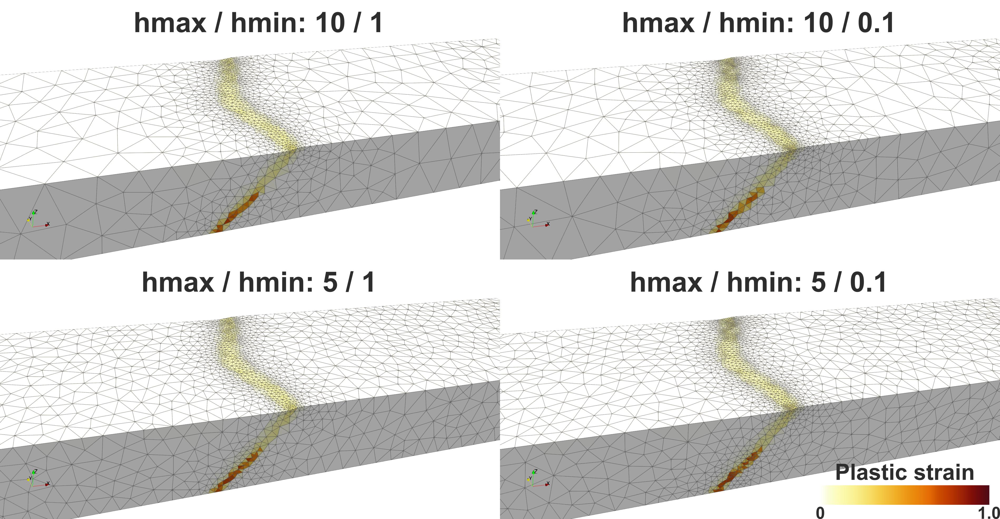

# Adaptive mesh refinement with MMG

## In a nutshell,

- Install [MMG](https://mmgtools.org).
	- `libmmg3d.a` or `libmmg2d.a` is expected to be available.
	- With minimal required dependencies, it should be straightforward to build MMG.
- With `use_mmg = 1` in `Makefile`, remeshing will use MMG for adaptive mesh refinement.
- The following two parameters control the maximum and minimum element size during remeshing. For instance,

	- `mmg_hmax_factor = 10.0`: The largest element will have an edge length 10 times `param.mesh.resolution`
	- `mmg_hmin_factor = 0.1`: The smallest element will have an edge length 0.1 times `param.mesh.resolution`
- `compute_metric_field()` in `remesh.cxx` is currently hardwired to use plastic strain ($\varepsilon_{pl}$) to scale element size from $h_{max}$ to $h_{min}$ as 1/(1+$10 \varepsilon_{pl}$).
	- In the future, users should be able to change the factor 10 or the function form itself.
- Note that since $\varepsilon_{pl}$ can only increase, the total mesh size will grow with it. 
	- To maintain a certain mesh size, *mesh optimization* is needed.
	- DES3D is currently hardwired to provide a 'solution' filed [see below](#workflow-during-remeshing-with-mmg) and thus perform remeshing.
	- It should be a user option whether to provide a solution field or not.

## Screenshots
- `examples/core-complex-mmg.cfg`
- `param.mesh.resolution`: 1 km



## Technical details

### Parameters for MMG

- `mmg_debug`: Turn on/off *debug* mode. In debug mode, MMG checks if all structures are allocated.
- `mmg_verbose`: Level of verbosity, -1 to 10.
- `mmg_hmax_factor`: Positive number. The maximum possible element size set to be `hmax * param.mesh.resolution`
- `mmg_hmin_factor`: Positive number. The minimum possible element size set to be `hmin * param.mesh.resolution`
- `mmg_hausd_factor`: Global Hausdorff distance (on all boundaries in the mesh). Roughly speaking, allowed difference of the boundary before and after mesh refinement or optimization.

For more MMG parameters, refer to https://mmgtools.github.io/libmmg3d_8h.html#a964a06109019542d04f12263c3fae24d


For instance,
```JSON
mmg_debug = 0
mmg_verbose = 0
mmg_hmax_factor = 10.0
mmg_hmin_factor = 1.0
mmg_hausd_factor = 0.01
```

### Using MMG for remeshing

One needs to set `usemmg` to `1` in `Makefile`:
```Makefile
usemmg = 1
```

In `Makefile`, the following build parameters are set:
```Makefile
ifeq ($(usemmg), 1)
        # path to MMG3D header files
        MMG_INCLUDE = $(HOME)/opt/mmglib/include

        # path of MMG3D library files, if not in standard system location
        MMG_LIB_DIR = $(HOME)/opt/mmglib/lib

        MMG_CXXFLAGS = -I$(MMG_INCLUDE) -DUSEMMG
        ifeq ($(ndims), 3)
                MMG_LDFLAGS = -L$(MMG_LIB_DIR) -lmmg3d
        else
                MMG_LDFLAGS = -L$(MMG_LIB_DIR) -lmmg2d
        endif
        ifneq ($(OSNAME), Darwin)  # Apple's ld doesn't support -rpath
                MMG_LDFLAGS += -Wl,-rpath=$(MMG_LIB_DIR)
        endif
endif
```

```Makefile
ifeq ($(usemmg), 1)
        CXXFLAGS += $(MMG_CXXFLAGS)
        LDFLAGS += $(MMG_LDFLAGS)
endif
```

When `USEMMG` is defined during the build process with `-DUSEMMG`, `remesh()` function calls `optimize_mesh()`, not `new_mesh()`.

```C++ {6} showLineNumbers
void remesh(const Param &param, Variables &var, int bad_quality)
{
...
#ifdef THREED
#if defined ADAPT || defined USEMMG
        optimize_mesh(param, var, bad_quality, old_coord, old_connectivity,
                 old_segment, old_segflag);
#else
        new_mesh(param, var, bad_quality, old_coord, old_connectivity,
                 old_segment, old_segflag);
#endif
...
```

### `optimize_mesh()`

#### Options for the bottom boundary

The option `param.mesh.remeshing_option` determines what to do to the bottom boundary during remeshing. However, it does not directly control how MMG performs mesh optimization. 

```C++
/* choosing which way to remesh the boundary */
    switch (param.mesh.remeshing_option) {
    case 0:
        // DO NOT change the boundary
        excl_func = &is_boundary;
        break;
    case 1:
        excl_func = &is_boundary;
        flatten_bottom(old_bcflag, qcoord, -param.mesh.zlength,
                       points_to_delete, min_dist);
        break;
    case 2:
        excl_func = &is_boundary;
        new_bottom(old_bcflag, qcoord, -param.mesh.zlength,
                   points_to_delete, min_dist, qsegment, qsegflag, old_nseg);
        break;
    case 10:
        excl_func = &is_corner;
        break;
    case 11:
        excl_func = &is_corner;
        flatten_bottom(old_bcflag, qcoord, -param.mesh.zlength,
                       points_to_delete, min_dist);
        break;
    case 12:
        flatten_x0(old_bcflag, qcoord, points_to_delete);
        break;
    default:
        std::cerr << "Error: unknown remeshing_option: " << param.mesh.remeshing_option << '\n';
        std::exit(1);
    }
```

#### Workflow during remeshing with MMG

1. Initialization
2. Mesh building in MMG5 format
3. Solution (i.e., metric) field building
	- When a solution filed is provided, MMG's mesh optimization, re-shaping element respecting the original sizes, does NOT occur. Instead, new elements are created as desired according to the parameters.
	- The current default mode in DES3D is to provide a solution field.
	- For this purpose, there is a customizable function, `compute_metric_field()` in `remesh.dxx`. More about this function below.
4. Mesh optimization
5. Mesh-related data update using the optimized MMG5 mesh

#### `compute_metric_field()`

This function converts accumulated plastic strain into a per-node metric
(target edge length) that MMG uses to resize elements. The metric for
each element is computed from that element's own current size scaled by
a `sizefactor`, then clipped to the user-specified bounds:

$$h_e = \frac{h_e^{\text{orig}}}{1 + 10\,\varepsilon_{pl,e}}$$
$$h_e = \text{clamp}(h_e,\; h_{\min},\; h_{\max})$$

where
- $h_e^{\text{orig}}$ is the element's own current edge length (not the global `resolution`), ensuring the metric is spatially adaptive from the start
- $h_{\max} =$ `mmg_hmax_factor × resolution`
- $h_{\min} =$ `mmg_hmin_factor × resolution`

Element metrics are then volume-averaged onto the nodes to produce the
nodal solution field that MMG consumes.

For example, with `resolution = 1e3` m, `mmg_hmax_factor = 2.0`,
`mmg_hmin_factor = 0.1`:

- $h = 2\,\text{km}$ where $\varepsilon_{pl} = 0$
- $h = 2\,\text{km} / (1 + 10\,\varepsilon_{pl})$ while $h > 100\,\text{m}$
- $h = 100\,\text{m}$ once $\varepsilon_{pl} > 1.9$

---

## Using MMG for initial mesh generation

For large 3D models (roughly >5 million elements), TetGen can be slow or
crash during the initial mesh generation step. DES3D supports an
optional two-stage initialization that uses TetGen to create a coarse
seed mesh and then refines it with MMG to the target resolution.

Enable it in your config file:

```cfg
use_mmg_init = 1
mmg_init_coarsening_factor = 4.0   # TetGen seed is 4× coarser than target resolution
```

`use_mmg_init` is only effective when DES3D is compiled with `usemmg = 1`.
If MMG support is absent, the parameter is silently ignored and the standard
TetGen path is used.

| Parameter | Default | Description |
|-----------|---------|-------------|
| `use_mmg_init` | `0` | Set to `1` to enable two-stage MMG initialization (requires `usemmg = 1`) |
| `mmg_init_coarsening_factor` | `4.0` | TetGen generates a mesh `N×` coarser than the target; MMG then refines it |

:::tip When to use
Enable `use_mmg_init` when your 3D model has more than ~2 million target
elements and TetGen initialization takes more than a few minutes or
produces memory errors.
:::
