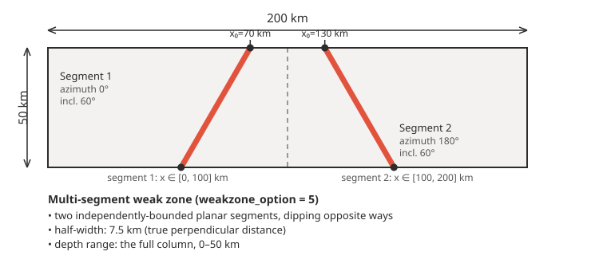
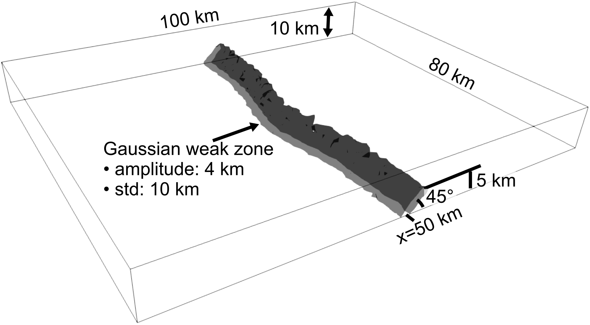

# Weak zones

DES3D supports several ways to define fault-like weak zones that focus
deformation in a model, selected with `weakzone_option` in the `[ic]`
section:

| `weakzone_option` | What it creates |
|---|---|
| `0` | No weak zone |
| `1` | A single planar weak zone: azimuth, inclination, half-width, depth range and center location |
| `2` | An ellipsoidal weak zone: center location and semi-axes |
| `3` | A Gaussian-distribution point weak zone: center location and standard deviation |
| `4` | A single planar fault whose map-view position bulges along strike following a Gaussian — see [below](#gaussian-along-strike-shift-weakzone_option--4) |
| `5` | Multiple general planar segments — see [below](#multi-segment-weak-zones-weakzone_option--5) |

`weakzone_azimuth` is measured relative to the model's +y axis, not
geographic north, and `weakzone_inclination` relative to the horizontal
plane — both in degrees.

## Multi-segment weak zones (`weakzone_option = 5`)

For models that require more than one pre-existing fault (e.g.,
conjugate normal faults or a step-over fault system), use
`weakzone_option = 5`. This option accepts any number of planar fault
segments, each with its own center, orientation, half-width and spatial
bounds; a point belongs to the weak zone if any segment contains it.

Each segment uses a `General_planar_zone` formulation with a proper
unit-normal, avoiding the `tan(azimuth)` numerical singularity of the
single-fault `Planar_zone` (option 1).

### Configuration

Every `weakzone_segments_*` parameter is an array with one entry per
segment, `[v0, v1, ...]`, of length `weakzone_num_segments`:

```cfg
[ic]
weakzone_option      = 5
weakzone_plstrain    = 0.5   # plastic strain assigned inside any segment
weakzone_num_segments = 2    # number of fault segments

# Segment centers (normalized 0-1, in units of mesh.xlength/ylength/zlength)
weakzone_segments_xcenter = [0.35, 0.65]
weakzone_segments_ycenter = [0.5,  0.5]    # 3D only
weakzone_segments_zcenter = [0.5,  0.5]

# Opposite dip directions, same dip angle
weakzone_segments_azimuth     = [0,   180]  # degrees, relative to +y axis
weakzone_segments_inclination = [60,  60]   # degrees, relative to horizontal
weakzone_segments_halfwidth   = [1.5, 1.5]  # in units of mesh.resolution

# Bounding box per segment (normalized 0-1)
weakzone_segments_x_min     = [0.0, 0.5]
weakzone_segments_x_max     = [0.5, 1.0]
weakzone_segments_y_min     = [0.0, 0.0]    # 3D only
weakzone_segments_y_max     = [1.0, 1.0]    # 3D only
weakzone_segments_depth_min = [0.0, 0.0]
weakzone_segments_depth_max = [1.0, 1.0]
```



See `examples/conjugate-faults-3d.cfg` for this two-segment conjugate
normal-fault setup in full.

:::tip Number of segments
`weakzone_num_segments` can be set to any positive integer; every
`weakzone_segments_*` array above must then have exactly that many
entries.
:::

## Gaussian along-strike shift (`weakzone_option = 4`)

`weakzone_option = 4` places a single planar fault — geometrically the
same as option 1 (azimuth, inclination, half-width, depth range, center)
— but shifts its map-view x-position along strike by a Gaussian bulge:

$$
x(y) = x_0 + A \exp\!\left(-\frac{(y - y_0)^2}{2\sigma^2}\right)
$$

where $A$ is `weakzone_gaussian_amplitude` and $\sigma$ is
`weakzone_standard_deviation`. This is useful for localizing the initial
failure to the center of the model domain while tapering to a straight
fault toward the lateral edges.

```cfg
[ic]
weakzone_option   = 4
weakzone_azimuth      = 0.0     # relative to +y axis (degrees)
weakzone_inclination  = -45.0   # relative to horizontal plane (degrees)
weakzone_halfwidth    = 1.2     # in units of mesh.resolution
weakzone_depth_min    = 0.5
weakzone_depth_max    = 1.0
weakzone_xcenter      = 0.5
weakzone_ycenter      = 0.5     # 3D only
weakzone_zcenter      = 1.0
weakzone_y_min        = 0.0     # 3D only
weakzone_y_max        = 1.0     # 3D only
weakzone_plstrain     = 0.5

weakzone_gaussian_amplitude = -4000  # x-shift at peak (m)
weakzone_standard_deviation = 1e4    # sigma along y (m)
```



See [`gospl_driver/examples/gaussian-weakzone-3d-with-gospl.cfg`](https://github.com/GeoFLAC/DynEarthSol/blob/master/gospl_driver/examples/gaussian-weakzone-3d-with-gospl.cfg)
for this exact configuration, combined with GoSPL surface-process
coupling — see [Coupling with GoSPL](./couplinggospl).
